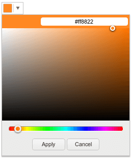

# ColorPicker Overview

The [Kendo UI ColorPicker widget](http://demos.telerik.com/kendo-ui/colorpicker/index) is a drop-down widget for selecting colors.

It is designed to replace the HTML5 `<input type="color">` tag which is not widely supported in browsers.

## Getting Started

### Initialize the ColorPicker

To initialize the ColorPicker, use a jQuery ID selector.

    <input type="color" id="myColorField" />

    

The original `input` element is kept in the DOM. The `value` attribute element gets updated as the user selects a color. This allows the submission of forms with ColorPicker widgets.

## Configuration

The default pop-up contains an HSV (Hue, Saturation, Value) selector (see **Figure 1**).

**Figure 1: HSV picker**

### Simple Color Picker

To create a simple color picker, use the following example.

    <input type="color" id="myColorField" />

    

The example renders a basic ColorPicker that contains 20 colors.

**Figure 2: Simple color picker with a basic pallette**

### Web-Safe Color Palette

To create the Web-safe color palette, use the following example.

    <input type="color" id="myColorField" />

    

The example renders the 216-color "web-safe" palette (see **Figure 3**).

**Figure 3: Simple color picker with a web-safe pallette**

### Custom Colors

To make the simple color picker display a custom list of colors, pass them in the `palette` argument.

###### Example

    <input type="color" id="myColorField" />

    

The example shows only white, black, and red. You can use any color in either short (3 digits) or long (6 digits) hex notation and omit the `#` sign.

### More Options

For more options, refer to the [API documentation](/api/javascript/color).

## See Also

* [Overview of the ASP.NET MVC HtmlHelper Extension for the ColorPicker Widget](http://docs.telerik.com/aspnet-mvc/helpers/colorpicker/overview)
* [Overview of the ColorPicker JSP Tag]()
* [Overview of the ColorPicker PHP Class](/php/widgets/colorpicker/overview)
* [ColorPicker JavaScript API Reference](/api/javascript/ui/colorpicker)

Articles on the Kendo UI ColorPalette:

* [Overview of the ASP.NET MVC HtmlHelper Extension for the ColorPalette Widget](http://docs.telerik.com/aspnet-mvc/helpers/colorpalette/overview)
* [Overview of the ColorPalette JSP Tag]()
* [Overview of the ColorPalette PHP Class](/php/widgets/colorpalette/overview)
* [ColorPalette JavaScript API Reference](/api/javascript/ui/colorpalette)
