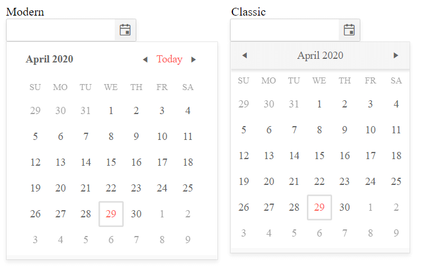

# Component Types

As of R2 2020 version of the Kendo UI suite, the DatePicker widget introduces a new component type. It aims to enhance the existing rendering and deliver a fresh and modern look and feel. 

By default, the DatePicker is initialized with the `classic` render mode. In order to set it to `modern`, configure the options of the widget as follows:

```
    $("#datepicker").kendoDatePicker({
        componentType:"modern"
    });
```

As a result, the appearance of the widget is alternated. 



## See Also

* [JavaScript API Reference of the DatePicker](/api/javascript/ui/datepicker)