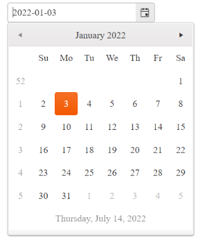

# {{ site.product }} DatePicker Overview

The DatePicker enables the user to select a date from a calendar or through a direct input.

It provides options for using custom templates for its **Month** view, setting minimum and maximum dates, a start view, and a depth for navigation.

## Functionality and Features

|Feature|Definition
|:---|:---
| [Disabled dates]()|In the DatePicker, you can disable specific days, such as weekends and national holidays, so that they cannot be selected by the end user.
| [Selected dates]()|The DatePicker allows you to render pre-selected dates and define date ranges. 
| [Start View and Navigation Depth]()|You can set the initial DatePicker view and define the view depth to which the user can navigate.
| [Input value validation]()|While, by design, the DatePicker keeps its input value unchanged, it still provides options for you to utilize a client-validation framework and render prompt error messages. 
| [Calendar types]()|Even though the DatePicker supports only the Gregorian calendar by default, you can still simulate other calendar types such as Lunar. 
| [Week number column]()|The DatePicker enables you to display a column with the number of weeks within the current **Month** view.
| [DateInput integration]()|You can smoothly integrate the DatePicker with the Kendo UI for jQuery DateInput control for its displayed input element.
| [Templates]()|The DatePicker supports the implementation of templates which enable you to customize its elements such as cells, footer, and week column.   
| [Globalization]()|The DatePicker supports globalization to ensure that it can fit well in any application, no matter what [languages and locales]() need to be supported. Additionally, the DatePicker supports [rendering in a right-to-left (RTL) direction]().
| [Accessibility]()|The DatePicker is accessible for screen readers, supports WAI-ARIA attributes, and delivers [keyboard shortcuts for faster navigation]().

## Next Steps

* [Getting Started with the Kendo UI DatePicker for jQuery]()
* [Basic Usage of the DatePicker (Demo)](https://demos.telerik.com/kendo-ui/datepicker/index)
* [Basic Events in the DatePicker (Demo)](https://demos.telerik.com/kendo-ui/datepicker/events)

## See Also 

* [Binding the DatePicker over MVVM (Demo)](https://demos.telerik.com/kendo-ui/datepicker/keyboard-navigation)
* [Using the DatePicker with AngularJS Directives (Demo)](https://demos.telerik.com/kendo-ui/datepicker/angular)
* [Applying the DatePicker API (Demo)](https://demos.telerik.com/kendo-ui/datepicker/api)
* [JavaScript API Reference of the DatePicker](/api/javascript/ui/datepicker)
