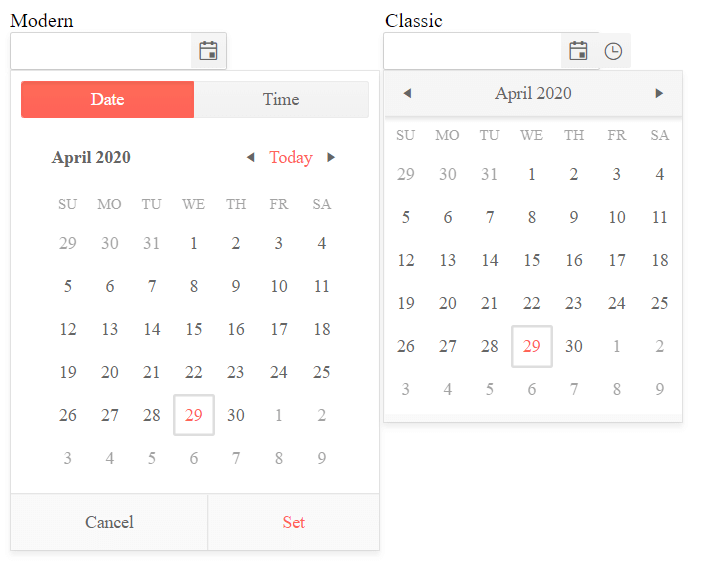

# Component Types

As of R2 2020 version of the Kendo UI suite, the DateTimePicker widget introduces a new component type. It aims to enhance the existing rendering and deliver a fresh and modern look and feel. 

By default, the DateTimePicker is initialized with the `classic` render mode. In order to set it to `modern`, configure the options of the widget as follows:

```
    $("#datetimepicker").kendoDateTimePicker({
        componentType:"modern"
    });
```

As a result, the appearance of the widget is alternated. 



> The rendered selectors in the time picker of the Kendo UI DateTimePicker depend on the currently applied format. If the format is omitted, the default format from the application's culture is used. 

## See Also

* [JavaScript API Reference of the DatePicker](/api/javascript/ui/datetimepicker)