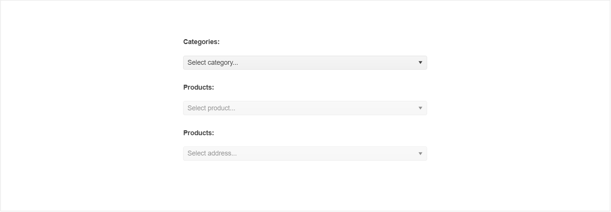

# DropDownList Overview

The DropDownList displays a list of values allowing for a single selection from the list, and supports key features like filtering, item templating, virtualization, and cascading.

The user input is restricted within the predefined options. To apply a keyboard input, use the [Kendo UI ComboBox]().

## Functionality and Features

|Feature|Definition
|:---|:---
|[Data binding]()|You can bind the DropDownList to local data arrays or remote data services.
|[Grouping]()|The DropDownList enables you to display data items that are categorized by a specific model field.
|[Server filtering]()|You can also filter the data of the DropDownList on the server and display only a subset of data.
|[Virtualization]()|With the DropDownList, you can display large datasets by using an alternative for paging that data.
|[Templates]()|The DropDownList enables you to fully control the rendering of its items, selected values, and popup headers.
|[Adding new items]()|Also, you can enable users to add a new item when the search results do not match their filtering conditions.
|[Cascading DropDownLists]()|The cascading functionality of the DropDownList enables you to implement a series of two or more DropDownLists in which each DropDownList is filtered according to the selected options in the previous DropDownList.
|[Rendering and dimensions]()|The DropDownList component provides a set of options for controlling its overall size, the border radius for its tags, and the way its color is applied.  
|[Globalization]()|The DropDownList supports globalization to ensure that it can fit well in any application, no matter what [languages and locales]() need to be supported. Additionally, the DropDownList supports [rendering in a right-to-left (RTL) direction]().
|[Accessibility]()|The DropDownList is accessible for screen readers, supports WAI-ARIA attributes, and delivers [keyboard shortcuts for faster navigation]().

## Next Steps 

* [Getting Started with the Kendo UI DropDownList for jQuery]()
* [Basic Usage of the DropDownList (Demo)](https://demos.telerik.com/kendo-ui/dropdownlist/index)
* [JavaScript API Reference of the DropDownList](/api/javascript/ui/dropdownlist)

## See Also

* [Binding the DropDownList to Data]()
* [Grouping in the DropDownList]()
