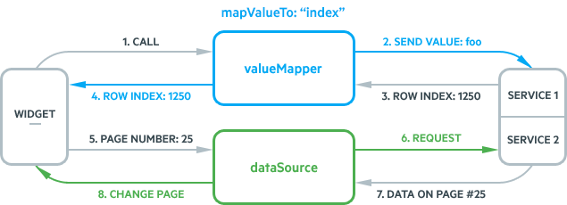
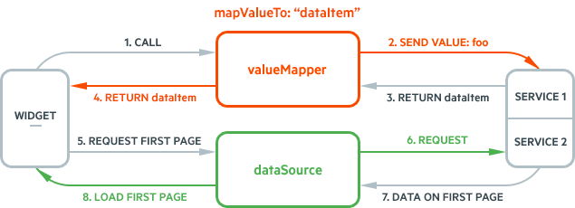

# Virtualization

The Kendo UI DropDownList enable you to display large datasets by using an alternative for paging the data.

Virtualization uses a fixed amount of list items in the popup list regardless of the dataset size. When the list is scrolled, instead of creating new items, the widget reuses the existing ones to display the relevant data.

## Basic Concepts and Requirements

In order for the virtualization to work properly, the DropDownList requires you to account for the functioning logic of the feature and to provide specific configurations.

* [Virtualizing UI and data](#virtuzalizing-ui-and-data)
* [Setting the height of the items](#setting-the-height-of-the-items)
* [Setting the height of the container](#setting-the-height-of-the-container)
* [Returning the appropriate data](#returning-the-approapriate-data)

### Virtualizing UI and Data

To retrieve and display only a subset of the whole dataset, the virtualization feature combines data and user interface (UI) virtualization.

The data virtualization of the DropDownList uses the `DataSource` paging functionality and a remote data retrieval. In this way, the widget retrieves only a specified data page instead of requesting the whole dataset at once. To ensure the proper functioning of the widgets, configure the `DataSource` paging correctly. For more information, refer to the [server paging](/api/javascript/data/datasource/configuration/serverpaging) configuration.

The UI virtualization of the DropDownList uses a specific strategy for reusing a list of DOM elements for displaying the corresponding data chunk. The number of these elements is determined based on the [`height`](/api/javascript/ui/dropdownlist/configuration/height) and [`itemHeight`](#itemheight) options. Once the number is calculated, the widget creates those elements and starts reusing them to display the current data source page.

The combined data and UI virtualization uses the calculated `pageSize` value based on the ([`height`](/api/javascript/ui/dropdownlist/configuration/height) / [`itemHeight`](#itemheight)) * 4 formula. That calculation is automatically done by the DropDownList and if the defined `pageSize` value does not match the calculated `pageSize` value, the calculated value takes precedence. For example, if the `height` of the DropDownList is `520px` and `itemHeight` is `26`, the `pageSize` will be set to `80`, because (520 / 26) * 4 equals `80`.

> * Enabling the paging and setting the `pageSize` of the DropDownList is efficient only when these features are used with virtualization.
> * Defining incorrect `pageSize` values triggers multiple initial requests. To avoid that, use the formula to calculate the `pageSize` value.

### Setting the Height of the Items

All items in the virtualized list have to be of the same height. If you do not specify a height value, the framework will automatically set the `itemHeight` in the way it is set in the current theme and font size.

> Not specifying the `itemHeight` option will result in an extra DataSource request. However, this does not normally cause critical issues.

### Setting the Height of the Container

If you do not explicitly specify the height of the virtualized list container, the list will use the default height of 200px.

### Returning the Appropriate Data

The response for each virtualization request has to include the following fields:
* An array with the specified page of data.
* The total count of all items that are present in the dataset of the `Total` field.

You can specify the fields that contain the array of [data](/api/javascript/data/datasource/configuration/schema#schemadata) and the [total](/api/javascript/data/datasource/configuration/schema#schematotal) in the configuration of the data source schema. Once a page of data is received on the client, it will be cached, and if the user scrolls up through the list, no new requests will be made for earlier pages of data and the virtualization will happen on the client only.

> To prevent infinite requests for the last page of data, ensure that the `Total` count is reached. If it is not, the widget will make requests until it receives the denoted total amount of unique items.

## Enabling Virtualization

The following example demonstrates how to enable virtualization in the DropDownList and shows the minimum widget and DataSource configuration requirements for the virtualization to work as expected.

###### Example

```dojo
    <input id="orders" style="width: 400px" />
    <script>
        $(document).ready(function() {
            $("#orders").kendoDropDownList({
                template: '#= OrderID # | #= ShipName #',
                dataTextField: "ShipName",
                dataValueField: "OrderID",
                virtual: {
                    itemHeight: 26,
                    valueMapper: function(options) {
                        $.ajax({
                            url: "https://demos.telerik.com/kendo-ui/service/Orders/ValueMapper",
                            type: "GET",
                            dataType: "jsonp",
                            data: convertValues(options.value),
                            success: function (data) {
                                options.success(data);
                            }
                        })
                    }
                },
                height: 520,
                dataSource: {
                    type: "odata",
                    transport: {
                        read: "https://demos.telerik.com/kendo-ui/service/Northwind.svc/Orders"
                    },
                    pageSize: 80,
                    serverPaging: true,
                    serverFiltering: true
                }
            });
        });

        // This is a helper method that serializes values into an understandable format for the server.
        // This method is not obligatory to use. Instead, you need to send the value in a format that is understandable for the server.
        function convertValues(value) {
            var data = {};

            value = $.isArray(value) ? value : [value];

            for (var idx = 0; idx < value.length; idx++) {
                data["values[" + idx + "]"] = value[idx];
            }

            return data;
        }
    </script>
```

## Value Mapping

> As of the Kendo UI R3 2016 release, the implementation of the `valueMapper` function is optional. `valueMapper` is required only if the widget contains an initial value or if the `value` method is used.

The `valueMapper` function is called when you want to select a data item that is not present in the data source. Unlike simple data and UI virtualization, the `valueMapper` was introduced because the DropDownList has to maintain and display the selected data item based on the value alone. To display the selected text, the widget retrieves the selected data item which is part of a particular data page that is unknown to you. The required information is gathered with the `valueMapper` callback. The function passes the selected value and requests the corresponding row `index` or `dataItem` of that value depending on the `mapValueTo` configuration option. By default, `mapValueTo` is set to `"index"`. The `mapValueTo: "dataItem"` configuration is available as of the Kendo UI R3 2016 release.

When the widget receives a value which is not fetched from the remote server yet, it calls the `valueMapper` function and passes the selected values in that function. If the `mapValueTo` is not explicitly set to `dataItem`, the `valueMapper` implementation will return the respective data item index. From this index, the widget calculates the page number and in this way pre-fetches only that particular page by sending an additional AJAX request. If the value does not exist, the `valueMapper` will return `null`, `[]`, or `-1` and the widget will deselect the currently selected items.

###### Example

```javascript
    valueMapper: function(options) {
        $.ajax({
            url: "https://demos.telerik.com/kendo-ui/service/Orders/ValueMapper",
            type: "GET",
            data: options.value, // Send value to the server.
            success: function (data) {
                options.success(data); // Return the index number of the corresponding data item.
            }
        })
    }
```

The DropDownList enables you to determine if the `valueMapper` has to resolve a value to an `index` or a value to a `dataItem`. To define the type of value, use the `mapValueTo` option that accepts the `"index"` or the `"dataItem"` value. By default, the `mapValueTo` is set to `"index"` which does not affect the current behavior of the virtualization process.

If you implement the `mapValueTo: "dataItem"` configuration, the `valueMapper` will return the data items that correspond to the selected values. The widget will use the returned data items to render the selected values but will not scroll the list to the selected values. When the user opens the list, the widget will display the options from the first data page no matter whether the selected value is a part of the first page or not. This represents a limitation of the `mapValueTo: dataItem` configuration.

###### Example

```javascript
    mapValueTo: "dataItem",
    valueMapper: function(options) {
        $.ajax({
            url: "https://demos.telerik.com/kendo-ui/service/Orders/ValueMapper",
            type: "GET",
            data: options.value, //send value to the server
            success: function (dataItems) {
                options.success(dataItems); //return the dataItems that correspond to provided values
            }
        })
    }
```

### Sample Cases

* [Mapping to index values](#mapping-to-index-values)
* [Mapping to data item values](#mapping-to-data-item-values)

### Mapping to Index Values

To see the process of mapping to index values in action, use the sample case with the following widget configuration:
- The `pageSize` is set to `50`.
- The selected value is `foo`.

On initial load, the widget checks whether the selected value is present in the loaded data. If it is not, it performs the following actions:

1. It calls the `valueMapper`, requesting a row index that corresponds to the selected value `foo`.
2. The `valueMapper` calls the `service 1`, passing the selected value `foo` to it.
3. The `service 1` finds the row index that corresponds to the `foo` value. In this case it is `1250`.
4. The `valueMapper` function returns this row index to the widget.
5. The widget calculates the page number. In this case it is `25`.
6. The widget requests it from the `service 2` using the `dataSource`.
7. The `service 2` returns the corresponding 25th page.
8. The `dataSource` changes the page to `25` and displays the items showing the selected item too.

**Figure 1: The virtualization process**



The `valueMapper` is expected to return a row index or a list of indices when a multiple selection is available. That being said, the service is expected to return either an index (number) or a list of indices. If the value does not exist, the `valueMapper` returns `null`, `[]`, or `-1`, and the widget deselects the currently selected items. For a runnable  example, refer to the result of [the test service](https://demos.telerik.com/kendo-ui/dropdownlist/virtualization) that is used in the online demos.

###### Example

```javascript
$.ajax({
    url: "https://demos.telerik.com/kendo-ui/service/Orders/ValueMapper",
    type: "GET",
    dataType: "jsonp",
    data: { "values[0]": "10661" }
    success: function (data) {
        // The returned data is [413].
        options.success(data);
    }
})
```

The AJAX method calls URLs similar to `http://demos.telerik.com/kendo-ui/service/Orders/ValueMapper?values[0]=10661`. The result is `callback([413]) //the result is JSONP`. The service maps the selected value to a particular row index. The implementation of this functionality is completely under your control. However, the most simplified implementation includes the iteration of all items counting the index of the rows. A more optimized solution still is to use a dedicated SQL method that handles this action internally. You can do this by using the [`ROW_NUMBER()`](https://msdn.microsoft.com/en-us/library/ms186734.aspx) function.

### Mapping to Data Item Values

To see the process of mapping to data item values in action, use the sample case with the following widget configuration:
- The `pageSize` is set to `50`.
- The selected value is `foo`.

On initial load, the widget checks whether the selected value is present in the loaded data. If it is not, it performs the following actions:

1. It calls the `valueMapper`, requesting a dataItem that corresponds to the selected value `foo`.
2. The `valueMapper` calls the `service 1`, passing the selected value `foo` to it.
3. The `service 1` finds the dataItem that corresponds to the `foo` value. In this case it is `{text: "bar", value: "foo"}`.
4. The `valueMapper` function returns this dataItem to the widget.
5. The widget renders the selected item template.
6. The widget requests the first page from `service 2` using the `dataSource`.
7. The `service 2` returns the first data page.
8. The widget list displays the items from the first page no matter if the selected items are part of it or not.



The `valueMapper` is expected to return a data item or a list of data items when a multiple selection is available. That being said, the service is expected to return either an data item (object) or a list of data items. If the values does not exist, the `valueMapper` returns `null` or `[]`, and the widget deselects the currently selected values.

## Known Limitations

- The virtualization feature can work with objects while virtualization of primitive values is not supported.
- The rendered items have to be of equal height. Every single item in the virtualized list displays a height that is set through the [`itemHeight`](#itemheight) option.
- The virtualization feature performs a complex data pre-fetching and assumes that the DataSource state will not change without the knowledge of the widget. Any manual data operations, such as `read`, `page`, `filter`, `add`, `remove`, and other, might lead to unexpected behavior for the widget and are not supported.

## See Also

* [Virtualization by the DropDownList (Demo)](https://demos.telerik.com/kendo-ui/dropdownlist/virtualization)
* [JavaScript API Reference of the DataSource](/api/javascript/data/datasource)
* [JavaScript API Reference of the DropDownList](/api/javascript/ui/dropdownlist)
