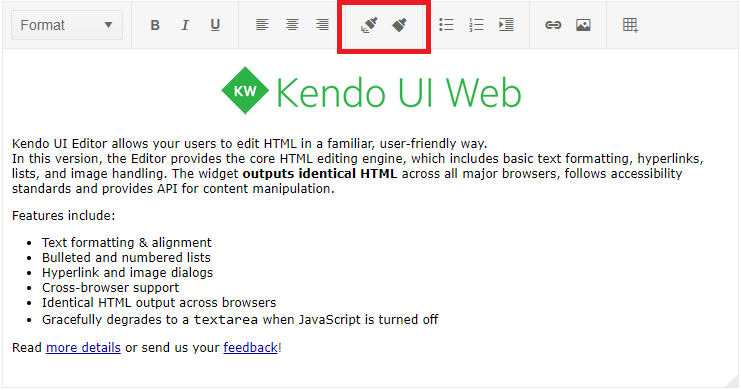

# Format Painter

The **Format Painter** tool allows for users to select a section of text and copy its formatting (font, size, color, etc.) and apply it to another section within the content.

## Format Painter Basics

The tool is very similar to the FormatPainter of MS Word®, and is quite useful and time saving when needed to apply identical formatting to multiple sections of the edited content. The Format Painter tool consists of two separate tool buttons available by default on the Editor toolbar:

* The **Copy Format** button will copy the formatting from the element, where the current selection starts at.
* The **Apply Format** button will apply the already copied format to the section that is currently selected. If no formatting has been copied, the Apply format will not execute any logic.

## How it Works

Format a section with the desired bold, italic, underline, font size and font family and other formatting and press the **Copy Format** button. This operation will save the formatting of the selected content in the clipboard. If the selection includes sections with different formatting, the tool will copy the styles from the section where the selection starts.

To apply the saved formatting, select the text that you want to format and click the **Apply Format** button.

## Supported formatting

The tool will copy and apply all inline styles. Also, any classes and attributes present in the source will be copied to the target.

The tool will also transfer the dom structure from the source to the target, clearing the previous DOM structure. The exceptions are the following targets:

* `<li>` target elements will not be modified. Instead, the copied structure will be applied within them.
* `<th>` and `<td>` target elements will not be modified. The copied structure will also be applied within them.

## See Also

* [Editor Format Painter tool (Demo)](https://demos.telerik.com/kendo-ui/editor/format-painter)
* [JavaScript API Reference of the Editor](/api/javascript/ui/editor)
