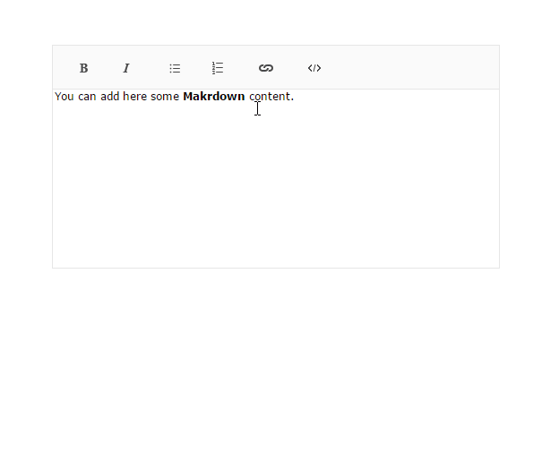

# Create Markdown Editors

You can transform the Kendo UI Editor widget into a Markdown editor by using third-party JS libraries.



The following example relies on the [`deserialization`](/api/javascript/ui/editor/configuration/deserialization) and [`serialization`](/api/javascript/ui/editor/configuration/serialization) options provided by the Kendo UI Editor. These are configured by applying custom options to call the methods that are necessary for the conversion from HTML to Markdown.

The actual transformation from HTML to Markdown is not part of the Kendo UI Editor and can be accomplished by using third-party JS libraries. For the example, the following example applies the MIT licensed [markdown-js](https://github.com/evilstreak/markdown-js) and [html-md](https://www.npmjs.com/package/html-md) libraries. However, you might use any other library that best suits your project.

The following example demonstrates how transform the Kendo UI Editor widget into a Markdown editor by using third-party JS libraries.

```dojo
<script src="https://unpkg.com/markdown@0.5.0/lib/markdown.js"></script>
<script src="https://unpkg.com/turndown@5.0.3/dist/turndown.js"></script>

<textarea name="editor" id="editor" cols="30" rows="10">
    You can add here some **Makrdown** content.
</textarea>

<script>
    var turndownService = new TurndownService();
    $("#editor").kendoEditor({
        deserialization: {
            custom: function(html) {
                return markdown.toHTML(html, "Maruku");
            }
        },
        serialization: {
            custom: function(html) {
                return turndownService.turndown(html);
            }
        },
        tools: [
            "bold",
            "italic",
            "insertUnorderedList",
            "insertOrderedList",
            "createLink",
            "unlink",
            "viewHtml"
        ],
        messages: {
            viewHtml: "View Source"
        }
    })
</script>
```

## See Also

* [Basic Usage of the Editor (Demo)](https://demos.telerik.com/kendo-ui/editor/index)
* [Using the API of the Editor (Demo)](https://demos.telerik.com/kendo-ui/editor/api)
* [JavaScript API Reference of the Editor](/api/javascript/ui/editor)
