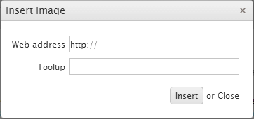
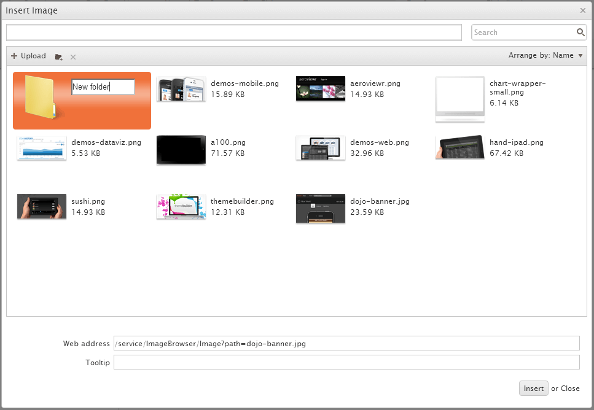

# Image Browser

By default, the **Insert Image** tool opens a simple dialog that allows you to type in or paste the URL of an image and, optionally, specify a tooltip.

The Editor also supports another way of picking an image by browsing a list of predefined files and directories. Uploading new images is also supported.

To retrieve and upload the files and directories, the image browser needs a server-side implementation. To configure the image browser tool, use the [`imagebrowser`](/api/javascript/ui/editor/configuration/imagebrowser) configuration option.

       $(document).ready(function(){
         $("#editor").kendoEditor({
             imageBrowser: {
                transport: {
                    read: "imagebrowser/read",
                    destroy: "imagebrowser/destroy",
                    create: "imagebrowser/createDirectory",
                    uploadUrl: "imagebrowser/upload",
                    thumbnailUrl: "imagebrowser/thumbnail"
                    imageUrl: "/content/images/{0}"
                }
             }
         });
      });

The following list provides information about the default requests and responses for the `create`, `read`, `destroy`, and `upload` operations.

- `create`&mdash;Makes a `POST` request for the creation of a directory with the following parameters and does not expect a response.

        { "name": "New folder name", "type": "d", "path": "foo/" }

- `read`&mdash;Makes a `POST` request that contains the `path` parameter to specify the path which is browsed and expects a file listing in the following format.

        [
            { "name": "foo.png", "type": "f", "size": 73289 },
            { "name": "bar.jpg", "type": "f", "size": 15289 },
            ...
        ]

    Where `name` is the file or directory name, `type` is either an **f** for a file or a **d** for a directory, and `size` is the file size (optional).

- `destroy`&mdash;Makes a `POST` request with the following parameters:

    - `name`&mdash;The file or directory to be deleted.
    - `path`&mdash;The directory in which the file or the directory resides.
    - `type`&mdash;Whether a file or a directory is to be deleted (an **f** or a **d**).
    - `size`&mdash;(Optional) The file size, as provided by the `read` response.

- `upload`&mdash;Makes a `POST` request to `uploadUrl`. The request contains `FormData` containing the upload path, file name and type. Its payload consists of the uploaded file. The expected response is a `file` object in the following format:

        { "name": "foo.png", "type": "f", "size": 12345 }

- `thumbnailUrl`&mdash;Makes a `GET` request for each individual image in order to display its thumbnail in the explorer window. The single request parameter is the `path` to the image. The service is expected to respond with the image file for the thumbnail.
- `imageUrl`&mdash;Used by the Editor to generate the `src` attribute of the original image when it is inserted. It results in a `GET` request generated by the browser for each inserted image. The URL can point to a file system or to a service and is parameterized&mdash;the `{0}` placeholder denotes the `path` and `fileName` as received from the `Read` service. By default, the placeholder value is URL-encoded. To change this behavior, use a function that will return the expected string.

You can update all of these requests and responses through the [`imagebrowser`](/api/javascript/ui/editor/configuration/imagebrowser) configuration. Each of them exposes more options that you can tweak.

## See Also

* [Basic Usage of the Editor (Demo)](https://demos.telerik.com/kendo-ui/editor/index)
* [JavaScript API Reference of the Editor](/api/javascript/ui/editor)
