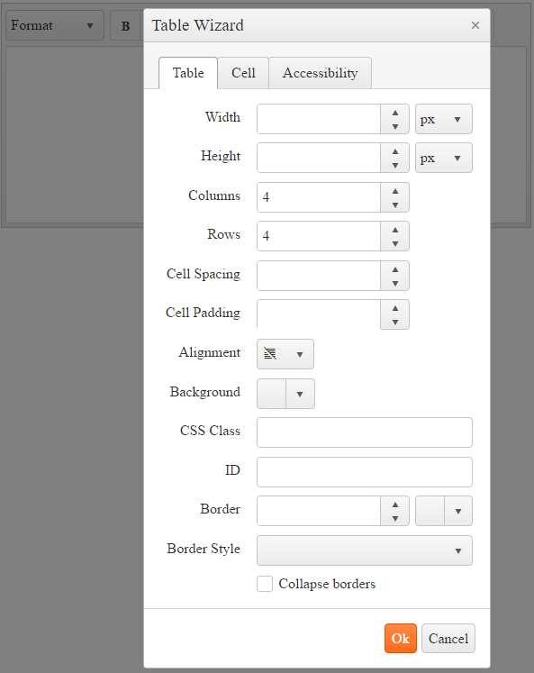
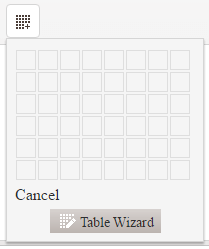
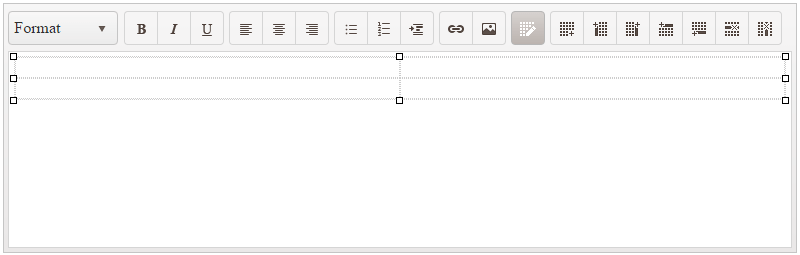

# Table Wizard Dialog

As of the Kendo UI R3 2016 release and in addition to the **Insert Table** tool, the user can add and configure tables by using the **Table Wizard** dialog.

## Inserting Tables

To insert a new table by using the **Table Wizard** dialog:

1. Open the **Insert Table** tool.
1. To open the dialog, click the **Table Wizard** button.
1. Configure the table that is to be inserted.
1. Click the **OK** button.

## Modifying Tables

To modify an existing table or a table cell:

1. Select the table or the table cell to edit.
1. Click the **Table Wizard** tool in the toolbar.

> You can resize the table rows and columns by dragging the cell border with the mouse and without using the **Table Wizard** dialog.

## Available Options

The table and cell options that are available in the **Table Wizard** are displayed in the following three tabs:

* [**Table**](#table-tab)&mdash;The available options for the table element.
* [**Cell**](#cell-tab)&mdash;The available options for the selected cell or all cells in the table.
* [**Accessibility**](#accessibility-tab)&mdash;The available options related to accessibility.

### Table Tab

The **Table** tab provides the following options:

* **Width**&mdash;Changes the width of the table (in pixels, em, or percent).
* **Height**&mdash;Changes the height of the table (in pixels, em, or percent).
* **Columns**&mdash;Defines the columns of the table.
* **Rows**&mdash;Defines the rows of the table.
* **Cell Spacing**&mdash;Specifies the space between the cells ([`cellspacing` attribute](http://www.w3schools.com/tags/att_table_cellspacing.asp)).
* **Cell Padding**&mdash;Specifies the padding in the cells ([`cellpadding` attribute](http://www.w3schools.com/tags/att_table_cellpadding.asp)).
* **Alignment**&mdash;Specifies the text alignment in the cells.
* **Background**&mdash;Specifies the background color of the table.
* **CSS Class**&mdash;Defines the class names for the table element (white space-separated).
* **ID**&mdash;Defines the id of the table element.
* **Border**&mdash;Defines the border size (in pixels only) and color.
* **Border Style**&mdash;Defines the border style (`none`, `hidden`, `dotted`, `dashed`, `solid`, `double`, `groove`, `ridge`, `inset`, `outset`, `initial`, and `inherit`).
* **Collapse borders**&mdash;Adds an inline style to that table element with the `border-collapse: collapse` rule ([`border-collapse` property](http://www.w3schools.com/cssref/pr_border-collapse.asp)).

### Cell Tab

The **Cell** tab provides the following options:

* **Select All Cells**&mdash;Applies the changes to all cells in the table.
* **Width**&mdash;Changes the width of the cell or cells (in pixels, em, or percent).
* **Height**&mdash;Changes the height of the cell or cells (in pixels, em, or percent).
* **Cell Margin**&mdash;Defines the margin of the cell or cells.
* **Cell Padding**&mdash;Defines the padding of the cell or cells.
* **Alignment**&mdash;Specifies the text alignment of the cell or cells.
* **Background**&mdash;Specifies the background color of the cell or cells.
* **CSS Class**&mdash;Defines class names for the cells (white space-separated).
* **ID**&mdash;Defines the id of the cells.
* **Border**&mdash;Defines the border size (in pixels only) and color of the cells.
* **Border Style**&mdash;Defines the border style (`none`, `hidden`, `dotted`, `dashed`, `solid`, `double`, `groove`, `ridge`, `inset`, `outset`, `initial`, and `inherit`).
* **Wrap text**&mdash;When unchecked, applies a `white-space: nowrap` style to the cells ([`white-space` property](http://www.w3schools.com/cssref/pr_text_white-space.asp)).

### Accessibility Tab

The **Accessibility** tab provides the following options:

* **Header Rows**&mdash;Allows the user to specify the number of rows in the table that should belong to header and should render `<th>` cell elements instead of `<td>`. When creating a new Table, those rows will be placed within a `<thead>` element.
* **Header Cols**&mdash;Allows the user to specify the number of columns in the table that would be headers for their respective rows. The cells will be rendered as `<th>` elements instead of `<td>`.
* **Caption**&mdash;Adds a [`caption` element](https://developer.mozilla.org/en-US/docs/Web/HTML/Element/caption) for the table with the respective text.
* **Alignment**&mdash;Defines the text alignment of the caption.
* **Summary**&mdash;Adds a [`summary` attribute](http://www.w3schools.com/tags/att_table_summary.asp) to the table using value defined. The `summary` attribute has been deprecated in HTML5 and its use should be avoided when possible.
* **Associate headers**&mdash;Allows the user to specify the mode in which content cells should be associated with their header cells. it provides the following three options:
    * **None** - Will not explicitly associate cells. That is the default option and it is appropriate for tables with simple structure (no merged cells).
    * **Associate using 'scope' attribute** - The wizard will add the appropriate [`scope` attribute](https://developer.mozilla.org/en-US/docs/Web/HTML/Element/th) to all header cells.
    * **Associate using Ids** - The wizard will assign IDs to all header cells and will inject [`headers` attribute](https://developer.mozilla.org/en-US/docs/Web/HTML/Element/td) with the appropriate value to all data (and header, if needed) cells.

## See Also

* [Basic Usage of the Editor (Demo)](https://demos.telerik.com/kendo-ui/editor/index)
* [JavaScript API Reference of the Editor](/api/javascript/ui/editor)
