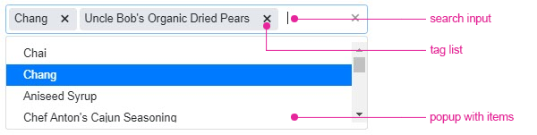

# Accessibility

The MultiSelect is accessible by screen readers and provides WAI-ARIA, Section 508, WCAG 2.1, and keyboard support.

For more information, refer to the overview article on [accessibility in Kendo UI for jQuery]().

## WAI-ARIA

The MultiSelect widget has three building blocks that use different aria properties on the nested elements depending on the current state of the widget and its options:

* Search input - used for filtering the list of choices.

* Tag list - used for displaying the selected values.

* Popup with items - used for displaying the list of items that can be selected.

### Search Input

The search input has the following specifics in regards to the used ARIA roles, states and properties:

* If the `placeholder` option is set, in order for screen readers to announce the placeholder text, the aria-label attribute has to be manually toggled on the input element.

The MultiSelect implements the following ARIA, states and properties for its search input:

| Role     | Attribute             | Usage                                       |
|----------|---------------------- |---------------------------------------------|
| [listbox](https://www.w3.org/TR/wai-aria-1.1/#listbox)  |                       | Identifies the popup with items.
|          | [aria-expanded](https://www.w3.org/TR/wai-aria-1.1/#aria-expanded)         | Indicates the state of the popup with items - expanded or collapsed. |
|          | [aria-haspopup](https://www.w3.org/TR/wai-aria-1.1/#aria-haspopup)         | Indicates that the widget has a popup. |
|          | [aria-autocomplete](https://www.w3.org/TR/wai-aria-1.1/#aria-autocomplete)     | Indicates that the provided user input will display a popup that contains a list of values that could complete the provided input. |
|          | [aria-describedby](https://www.w3.org/TR/wai-aria-1.1/#aria-describedby)  | Identifies the tag list as the description object and allows screen readers to announce the selected options upon focusing them. |
|          | [aria-busy](https://www.w3.org/TR/wai-aria-1.1/#aria-busy)             | Indicates if the widget is in the process of loading data. |
|          | [aria-disabled](https://www.w3.org/TR/wai-aria-1.1/#aria-disabled)         | Indicates if the widget is disabled. |
|          | [aria-activedescendant](https://www.w3.org/TR/wai-aria-1.1/#aria-activedescendant) | Indicates the active element when navigating through the list of selected options. |

### Tag List

The tag list has the following specifics in regards to the used ARIA roles, states and properties:

* In order for the screen readers to announce the selected options after deleting an item from the tag list, the option must be focused with the keyboard arrows first and then deleted by pressing the `Backspace` or `Delete` keys.

The MultiSelect implements the following ARIA roles, states and properties for its tag list:

| Role                                                    | Attribute     | Usage                                       |
|---------------------------------------------------------|---------------|---------------------------------------------|
| [listbox](https://www.w3.org/TR/wai-aria-1.1/#listbox)  |               | Identifies the list of selected options.
| [option](https://www.w3.org/TR/wai-aria-1.1/#option)    |               | Identifies each element containing the name of an option. |
|                                                         | [aria-setsize](https://www.w3.org/TR/wai-aria-1.1/#aria-setsize)  | Indicates the position of the option in the list. |
|                                                         | [aria-selected](https://www.w3.org/TR/wai-aria-1.1/#aria-selected) | Indicates that the tag list item is selected. |

The tag list implements the listbox role as it is the most suitable role that provides

### Popup with Items

The MultiSelect implements the following ARIA roles, states and properties for its popup with items:

| Role     | Attribute     | Usage                                       |
|----------|-------------  |---------------------------------------------|
| [listbox](https://www.w3.org/TR/wai-aria-1.1/#listbox)  |               | Identifies the list of selected options.
| [option](https://www.w3.org/TR/wai-aria-1.1/#option)   |               | Identifies each element containing the name of an option. |
|          | [aria-selected](https://www.w3.org/TR/wai-aria-1.1/#aria-selected) | Indicates that the tag list item is selected. |

## Section 508

The MultiSelect is compliant with the Section 508 requirements. For more information, refer to the article on [Section 508 support in Kendo UI for jQuery]().

## WCAG 2.1

The MultiSelect supports the standards for providing accessible web content which are set by the [Web Content Accessibility Guidelines 2.1](https://www.w3.org/TR/WCAG/).

For more information, refer to:

* [WCAG 2.1 support by the MultiSelect (Demo)](http://demos.telerik.com/kendo-ui/multiselect/index)
* [WCAG 2.1 compliance in Kendo UI for jQuery]()

## Keyboard Support

The MultiSelect also follows the [WAI-ARIA best practices](https://www.w3.org/TR/wai-aria-practices/) for implementing the [keyboard navigation](https://demos.telerik.com/kendo-ui/multiselect/keyboard-navigation) for its component role and is tested against the popular screen readers.

## See Also

* [WCAG 2.1 Support by the MultiSelect (Demo)](http://demos.telerik.com/kendo-ui/multiselect/index)
* [Keyboard Navigation by the MultiSelect (Demo)](http://demos.telerik.com/kendo-ui/web/multiselect/navigation.html)
* [Accessibility in Kendo UI for jQuery]()
* [WAI-ARIA Support in Kendo UI for jQuery]()
* [Section 508 Support in Kendo UI for jQuery]()
* [WCAG 2.1 Support in Kendo UI for jQuery]()
* [Keyboard Support in Kendo UI for jQuery]()