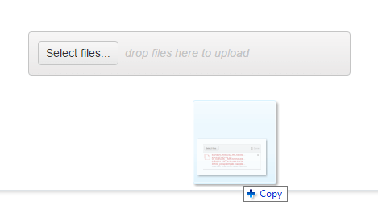
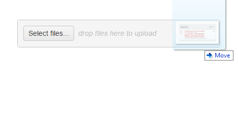
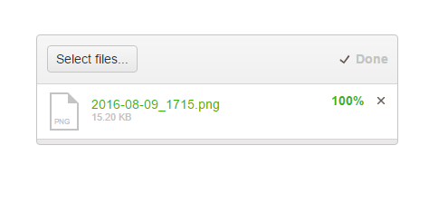
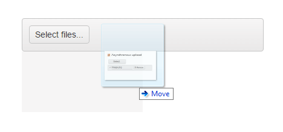

# Dragging and Dropping

The Upload enables the user to select files by dragging and dropping them over the Upload.

> The drag-and-drop functionality is available only when the Upload is in its [asynchronous mode](#asynchronous-mode) and also requires a [supported browser]().

## Uploading Files

To use the Kendo UI Upload as a drop zone:

1. Drag a file over the browser window for the drop zone to appear.

    

2. Highlight the drop zone by passing the mouse over it.

    

3. Release the file over the drop zone to add it to the upload queue.

    

## Implementing Custom Drop Zones

As of the Kendo UI 2016 Q3 release, the Upload provides options for implementing custom drop zones depending on a particular selector. For the runnable example, refer to the [demo on implementing custom drop zones in the Upload](https://demos.telerik.com/kendo-ui/upload/customdropzone).

To customize the appearance of the drop zone during the process of dragging and dropping, note the following specifics:

* When the user drags the file over the browser window, the custom drop zone element receives the `"k-dropzone-active"` class.
* When the user drags the file over the drop zone itself, the element receives an additional `"k-dropzone-hovered"` class and the drop zone is highlighted.

    

* Once the file is released over the drop zone, the file is added to the upload queue.

## Enabling Drop-Zone Visibility

By default, the drop zone is not visible.

The following example demonstrates how to override the default drop zone by applying CSS rules when the Upload itself is used as a drop zone.

    div.k-dropzone {
        border: 1px solid #c5c5c5; /* For Default; Different for each theme */
    }

    div.k-dropzone em {
        visibility: visible;
    }

<!--*-->
The following example demonstrates how to customize the appearance of the drop zone during the process of dragging and dropping.

    div.k-dropzone {
        border: 1px solid red;
    }

    .customDropZone.k-dropzone-active {
        border: 1px solid yellow;
    }
    .customDropZone.k-dropzone-active.k-dropzone-hovered {
        border: 1px solid green;
    }

## Uploading File Directories

You can also allow users to upload whole directories of files through dragging and dropping them over the Upload. For the runnable example, refer to the [demo on uploading directories of files with the Upload](https://demos.telerik.com/kendo-ui/upload/directoryupload).

## See Also

* [Implementing Custom Drop Zones in the Upload (Demo)](https://demos.telerik.com/kendo-ui/upload/customdropzone)
* [Uploading File Directories to the Upload (Demo)](https://demos.telerik.com/kendo-ui/upload/directoryupload)
* [JavaScript API Reference of the Upload](/api/javascript/ui/upload)
