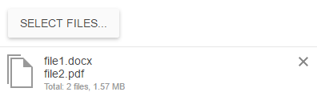

# Modes of Operation

The Upload supports a [synchronous](#synchronous-mode) and [asynchronous](#asynchronous-mode) modes of operation.

## Synchronous Mode

When the Upload is in its synchronous mode, the widget behaves like a regular file input. The selected files are uploaded upon form submission, the user can select a variable number of files, and the browser in use is not required to support the selection of multiple files.

The following example demonstrates how to initialize the Upload in a synchronous mode from an existing file input that is placed in a form. The array syntax in the input name is used to hint the Upload handler to treat the photos as an array. For more information on how to handle the uploaded files, refer to the documentation of your specific server technology.

    <form method="post" action="handler.php">
        

            <input name="photos[]" id="photos" type="file" />
        

    </form>

    $(document).ready(function() {
        $("#photos").kendoUpload();
    });

## Asynchronous Mode

When the Upload is in its asynchronous mode, the widget requires dedicated server handlers to store and remove the uploaded files. The selected files are immediately uploaded or, optionally, the selected files are uploaded upon user confirmation. The upload request is executed out-of-band without interrupting the page flow. For the runnable example, refer to the [demo on setting the Upload in an asynchronous mode of operation](https://demos.telerik.com/kendo-ui/upload/async).

### Getting Started

The asynchronous mode is implemented over the [HTML5 File API](https://en.wikipedia.org/wiki/HTML5_File_API). In legacy browsers, the Upload will continue to function by using a hidden `iframe` element.

1. Create an HTML `input` of type `"file"` (no `form` is required).

        <input name="photos[]" id="photos" type="file" />

2. Initialize the Upload and configure the asynchronous upload end-points. The array syntax for the field name is used to hint the upload handler to treat `"photos"` as an array.

        $("#photos").kendoUpload({
            async: {
                saveUrl: "saveHandler.php",
                removeUrl: "removeHandler.php",
                removeField: "fileNames[]"
            }
        });

### Configuring the save Handler

The `save` handler has to accept POST requests. The requests will contain one or more files with the same name as the `input`&mdash;in the case of the previous example, this is `"photos[]"`.

The `save` handler is expected to return any of the following responses:

* An empty response to signify success.
* A JSON string with `"text/plain"` content encoding. The de-serialized object is available in the `success` event handler.
* Any other response to signify failure.

### Configuring the remove Handler

The `remove` handler has to accept POST requests which can be configured through the [`removeVerb`](/api/javascript/ui/upload/configuration/async.removeverb) option. The requests will contain one or more text fields with the `"fileNames"` name&mdash;in the case of the previous example, change it to `"fileNames[]"` by using the `removeField` option.

The `remove` handler is expected to return any of the following responses:

* An empty response to signify success.
* A JSON string with `"text/plain"` content encoding. The de-serialized object is available in the [`success`](/api/javascript/ui/upload/events/success) event handler.
* Any other response to signify failure.

### Setting the Asynchronous Mode Fallback

When the Upload is placed inside a `form` and is configured for asynchronous operation, the widget has a fallback mechanism. Files that were not fully uploaded will be sent as part of the form upon its submission by the user. This behavior ensures that even if you do not take any special measures to block the **Submit** button during upload, no files will be lost. You need to handle the uploaded files both in the `save` handler and in the form submit action as in synchronous mode.

## See Also

* [Setting the Upload in Its Asynchronous Mode of Operation (Demo)](https://demos.telerik.com/kendo-ui/upload/async)
* [JavaScript API Reference of the Upload](/api/javascript/ui/upload)
