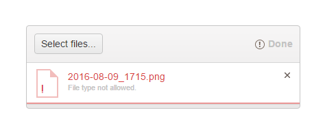
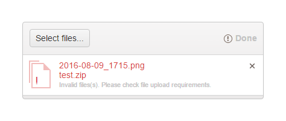

# File Restrictions

As of the Kendo UI 2016 Q3 release, the Upload enables you to validate the selected files for upload against their extension and size.

The following example demonstrates a sample configuration for file restrictions (validation).

        validation: {
    		allowedExtensions: [".jpg", ".rar"],
    		maxFileSize: 800000,
    		minFileSize: 200000
		}

The Upload supports the following types of file restrictions:

* [File extension](#file-extension)
* [Maximum file size](#maximum-file-size)
* [Minimum file size](#minimum-file-size)

For a runnable example, refer to the [demo on Upload file validation](https://demos.telerik.com/kendo-ui/upload/validation).

## File Extension

The `allowedExtensions` array object lists all file extensions that the Upload will accept for uploading. If the user tries to select a file with an extension that is not included in the array, the validation will fail and a validation error message will be rendered. Depending on whether the [`async.batch`](/api/javascript/ui/upload/configuration/async.batch) option is enabled, the validation messages can be differently displayed.

The following image displays a validation message when the batch mode of the Upload is disabled.

The following image displays a validation message when the batch mode of the Upload is enabled.

## Maximum File Size

The `maxFileSize` property defines the maximum size (in bytes) that is allowed for a file which is intended to be uploaded. If the selected file exceeds the maximum size, a validation error message will be displayed, for example, `File size too large.`.

## Minimum File Size

The `minFileSize` property defines the minimum size (in bytes) that is allowed for a file which is intended to be uploaded. If the size of the selected file is less than the minimum size, a validation error message will be displayed, for example, `File size too small.`.

## Browser Limitations

Internet Explorer version 10 or earlier provide no information on the file size. As a result, the Upload validation for the `minFileSize` and `maxFileSize` options will not work as expected.

## See Also

* [Implementing File Restrictions in the Upload (Demo)](https://demos.telerik.com/kendo-ui/upload/validation)
* [JavaScript API Reference of the Upload](/api/javascript/ui/upload)
