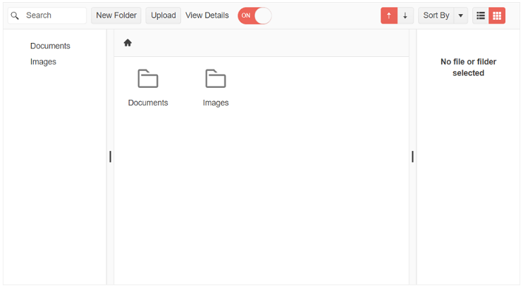

# {{ site.product }} FileManager Overview

The Kendo UI FileManager is an Explorer-like component enabling you to manage file and folders.

It enables you to organize and manage files and folders and provides you with a rich API for customization. You can show additional information about the selected file in a template-customizable Preview Pane, which you can show or hide via a switch button. The component is built entirely by Kendo UI for jQuery components: [Grid](), [ListView](), [TreeView](), [Toolbar](), [Breadcrumb](). 

## Functionality and Features

|Feature|Definition
|:---   |:---
| [Data binding]() | You can bind the FileManager to local or remote data.|
| [ContextMenu]() | You can configure the items that will be included in the ContextMenu.|
| [Drag and Drop]() | The FileManager allows you to enable or disable dragging of files and folders.|
| [Views]() | The FileManager provides `Grid` and `List` views.|
| [Navigation]() | The navigation in the FileManager is achieved through inbuilt TreeView and BreadCrumb components.|
| [PreviewPane]() | You can customize the appearance of the preview pane through multiple templates.| 
| [Search]() | The FilelManager enables you to search for specific file or folder.| 
| [Sort]() | The FileManager provides an inbuilt Sort functionality.|
| [Toolbar Commands]() | You can configure the items displayed in the integrated ToolBar component.|
| [Accessibility]() | The FileManager is accessible for screen readers, supports WAI-ARIA attributes, and delivers [keyboard shortcuts for faster navigation]().|
| [Globalization]() | The FileManager supports globalization to ensure that it can fit well in any application, no matter what [languages and locales]() need to be supported. Additionally, the FileManager supports [rendering in a right-to-left (RTL) direction]().|

Visit the [Client API section](/api/javascript/ui/filemanager) for full description of the configurations methods and events of the Kendo UI for jQuery FileManager component.

## See Also

* [Getting Started with the FileManager]()
* [Basic Usage of the FileManager (Demo)](https://demos.telerik.com/kendo-ui/filemanager/index)
* [Knowledge Base Section](/knowledge-base)
* [JavaScript API Reference of the FileManager](/api/javascript/ui/filemanager)
