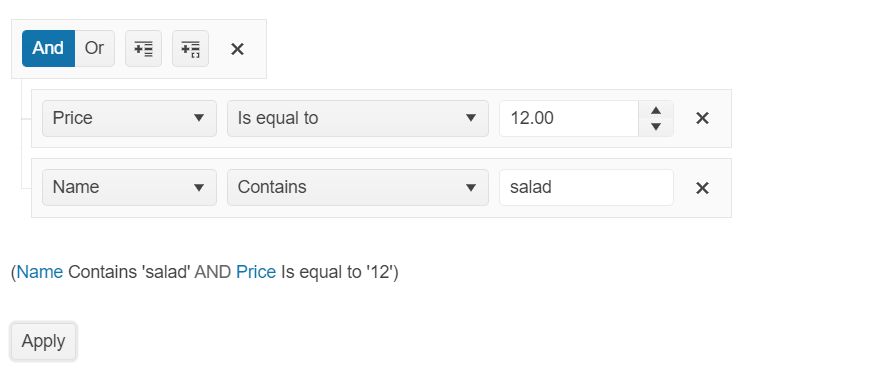

# {{ site.product }} Filter Overview

The [Kendo UI Filter component](https://demos.telerik.com/kendo-ui/filter/index) a unified control for filtering data-bound components that have a [data source](/api/javascript/data/datasource).

The user interface of the Filter is useful for data-bound components that do not have a built-in UI for filtering but are required to provide filter options&mdash;for example, the ListView, Chart, and Scheduler. You can add or remove the fields by which the data will be filtered and select the global logic of the filters (`AND` or `OR`) and the filter operator for each field (for example, `contains` or `equals`). You can apply the filtering through a built-in button or through an API call. You can also select the name by which the fields will be displayed to the user and [localize]() the filter operators and messages.

## Functionality and Features

* [Setting the Operators]()&mdash;You can determine which operators will be displayed in the Filter.
* [Persisting the State]()&mdash;You can store the state of the Filter. 
* [Globalization]()&mdash;The Filter supports globalization to ensure that it can fit well in any application, no matter what languages and locales need to be supported.

## Next Steps 

* [Getting Started with the Kendo UI Filter for jQuery]()
* [Demo Page for the Filter](https://demos.telerik.com/kendo-ui/filter/index)
* [JavaScript API Reference of the Filter](/api/javascript/ui/filter)

## See Also

* [Basic Usage of the Filter (Demo)](https://demos.telerik.com/kendo-ui/filter/index)
* [MVVM Binding by the Filter (Demo)](https://demos.telerik.com/kendo-ui/filter/mvvm)
* [Using the Editor Template in the Filter (Demo)](https://demos.telerik.com/kendo-ui/filter/custom-editors)
* [Persisting the State of the Filter (Demo)](https://demos.telerik.com/kendo-ui/filter/persist-state)
* [JavaScript API Reference of the Filter](/api/javascript/ui/filter)
