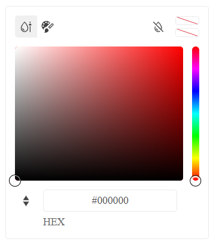

# {{ site.product }} FlatColorPicker Overview

The FlatColorPicker component provides a rich interface to choose a color from Palette and Gradient views. It enables the user to preview the selected color before submit and to ensure that a certain contrast requirements are met.

## Functionality and Features

* [Views]()&mdash;The component supports a gradient view and a palette view.
* [Formats]()&mdash;The component supports RGB and HEX input formats.
* [Contrast Tool]()&mdash;The component provides a color contrast tool, which checks the contrast ratio between two colors.
* [Accessibility]()&mdash;The FlatColorPicker supports various accessibility standards.

## Next Steps 

* [Getting Started with the Kendo UI FlatColorPicker for jQuery]()
* [Overview of the FlatColorPicker (Demo)](https://demos.telerik.com/kendo-ui/flatcolorpicker/index)
* [JavaScript API Reference of the FlatColorPicker](/api/javascript/ui/flatcolorpicker)

## See Also

* [Basic Usage of the FlatColorPicker (Demo)](https://demos.telerik.com/kendo-ui/flatcolorpicker/index)
* [Using the API of the FlatColorPicker (Demo)](https://demos.telerik.com/kendo-ui/flatcolorpicker/api)
* [JavaScript API Reference of the FlatColorPicker](/api/javascript/ui/flatcolorpicker)
