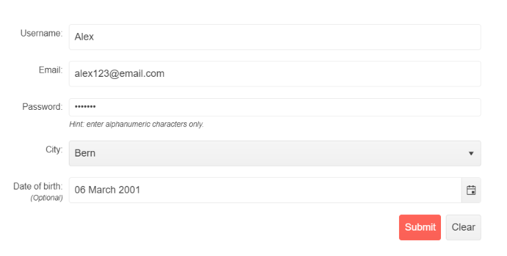

# {{ site.product }} Form Overview

The Kendo UI Form component allows you to generate and manage forms. Through a variety of configuration options, it makes creating and customizing forms a seamless experience. Achieve the desired form appearance by using default or custom editors, choose layout and orientation, display the editors in groups and columns, and configure validation.

## Functionality and Features

* [Items]()&mdash;Allows you to customize the appearance and behavior of the Form.
* [Layout]()&mdash;You can configure the layout of the items in the Form.
* [Groups]()&mdash;The Form provides an option to display its items in groups.
* [Orientation]()&mdash;You can configure the orientation of the component.
* [Validation]()&mdash;The Form provides built-in validation.
* [Buttons]()&mdash;The Form enables you to alter the built-in Submit and Clear buttons.

## Next Steps 

* [Getting Started with the Kendo UI Form for jQuery]()
* [Demo Page for the Form](https://demos.telerik.com/kendo-ui/form/index)
* [JavaScript API Reference of the Form](/api/javascript/ui/form)

## See Also

* [JavaScript API Reference of the Form](/api/javascript/ui/form)
* [Demo Page for the jQuery Form](https://demos.telerik.com/kendo-ui/form/index)
* [Knowledge Base Section](/knowledge-base)
* [jQuery Form Product Page](https://www.telerik.com/kendo-jquery-ui/form)
