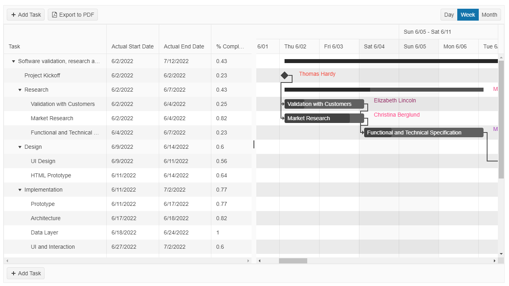

# {{ site.product }} Gantt Overview

The Gantt displays a set of tasks and dependencies which are used to visualize project-planning data.

It provides a tree-list section where the user can edit, sort and reorder the tasks in a grid-like fashion, and a time-line section where the tasks and dependencies are visualized under an adjustable time ruler. The user can resize, move, edit, and remove them. The Gantt also supports the display of the time-line section in the day, week, and month views.

## Functionality and Features

* [Layout]()&mdash;The Gantt uses a TreeList and a Timeline to visualize its items.
* [Data Binding]()&mdash;The component can be bound to either an array of local data or to data coming from a remote service.
* [Columns]()&mdash;The Gantt's columns support various features and attributes.
* [Planned vs Actual]()&mdash;The Gantt supports the Planned vs Actual feature to track your tasks' deadlines.
* [Views]()&mdash;The Gantt supports different timeline views.

## Next Steps 

* [Getting Started with the Kendo UI Gantt for jQuery]()
* [Demo Page for the Gantt](https://demos.telerik.com/kendo-ui/gantt/index)
* [JavaScript API Reference of the Gantt](/api/javascript/ui/gantt)

## See Also

* [Basic Usage of the Gantt (Demo)](https://demos.telerik.com/kendo-ui/gantt/index)
* [Using the API of the Gantt (Demo)](https://demos.telerik.com/kendo-ui/gantt/api)
* [JavaScript API Reference of the Gantt](/api/javascript/ui/gantt)
