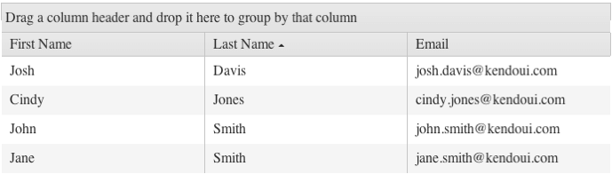

# Sorting

By default, sorting in the Grid is disabled.

For a runnable example, refer to the [demo on sorting in the Grid](https://demos.telerik.com/kendo-ui/grid/sorting).

## Getting Started

To enable the sorting functionality of the Grid, set the `sortable` option to `true`. As a result, the default single-column sorting functionality will be applied.  

To enhance the performance of the Grid, apply the sorting operations on the server by setting the `serverSorting` option of the data source to `true`. When server-sorting is enabled, you will receive the default `orderBy` parameter which contains the field name of the column by which the sorting of the dataset will be applied.

**Figure 1: A Grid with its sorting functionality enabled**

> Only columns that are [bound to a field](https://docs.telerik.com/kendo-ui/api/javascript/ui/grid/configuration/columns.field) can be sortable. To enable sorting on a column bound to an object, [bind the column to a field of that object](https://docs.telerik.com/kendo-ui/knowledge-base/enable-operations-for-object-column).

## Sort Modes

The Grid supports the following sort modes:
* [Single-column sort mode](#single-column-sorting)
* [Multi-column sort mode](#multi-column-sorting)
* [Mixed-column sort mode](#mixed-column-sorting)

### Single-Column Sorting

By default, the Grid applies single-column sorting when `sortable` is set to `true`. You can also configure the single-column sort mode by setting the `mode` option of `sortable` to `single`.

    $("#grid").kendoGrid({
         sortable: true
         // Other configuration.
    });

### Multi-Column Sorting

To enable multi-column sorting, set the `mode` option of `sortable` to `multiple`.

    $("#grid").kendoGrid({
        sortable: {
            mode: "multiple"
        },
        // Place other configuration parameters here.
    });

### Mixed-Column Sorting

Mixed Sorting allows users to [single-sort](#single-column-sorting) columns by clicking their title and [multi-sort](#multi-column-sorting) columns by holding the `CTRL` key and clicking the columns' title. A single-click (without holding the the `CTRL` key) on any column un-sorts the currently sorted columns and applies single-sorting to the clicked column.

To enable multi-column sorting, set the `mode` option of `sortable` property to `mixed`.

    $("#grid").kendoGrid({
        sortable: {
            mode: "mixed"
        },
        // Place other configuration parameters here.
    });

## KB Articles on Sorting

* [Enable Sorting for Columns Bound to Complex Object]()
* [Enabling the ForeignKey Column Sorting by Text]()
* [Implementing Stable Sorting in Chrome]()
* [Implementing Stable Sorting for Grouped Data in Chrome]()
* [Adding Background Color to Sorted Columns by Using LESS Themes]()
* [Find Out More in the Knowledge Base](/knowledge-base)

## See Also

* [Sorting by the Grid (Demo)](https://demos.telerik.com/kendo-ui/grid/sorting)
* [JavaScript API Reference of the Grid](/api/javascript/ui/grid)
