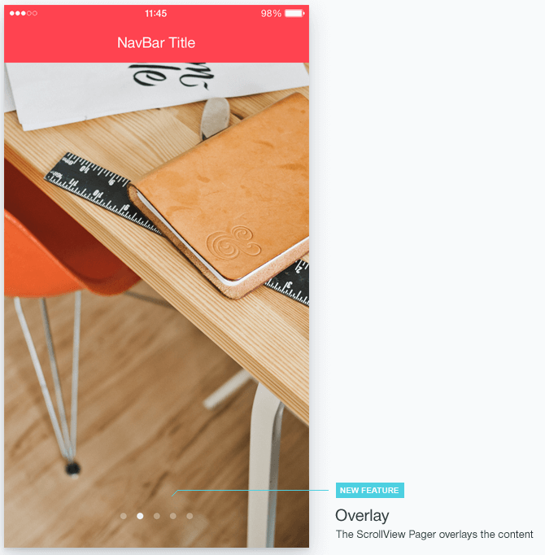

# Appearance

You can render a pager overlay in the Nova theme by adding the `km-scrollview-overlay` class to the ScrollView element.

    

        
Foo

        
Bar

    

## See Also

* [Basic Usage of the Hybrid ScrollView (Demo)](https://demos.telerik.com/kendo-ui/m/index#mobile-scrollview/mobile)
* [JavaScript API Reference of the Hybrid ScrollView](/api/javascript/mobile/ui/scrollview)
