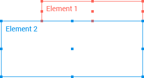

# Aligning and Positioning

The Popup enables you to [align](#aligning-to-elements) and [append](#appending-to-elements) it to elements, as well as [position it to specific points](#positioning) and [detect the viewport boundary](#viewport-boundary-detection).  

## Aligning to Elements

To align the Popup to a specific element, use the `anchor` option. As a result, the Popup will open next to the defined anchor element.

	
    
Anchor

	<button> Open/Close </button>
    

      <ul>
        <li>Item 1</li>
        <li>Item 2</li>
        <li>Item 3</li>
      </ul>
    

    

## Appending to Elements

To specify the element to which the Popup will be appended, use the `appendTo` configuration option. By default, the Popup uses the `document.body` option.

> Unless specified otherwise, the Popup attaches itself to the nearest parent container with a `"k-group"` class. This enables the seamless integration with other Kendo UI widgets such as the Menu. If this behavior causes unexpected results (for example, misalignment or loss of visibility), explicitly specify the `appendTo` option.

## Positioning

The positioning of the Popup is controlled by specific pivot points. Both the anchor and the Popup are treated as rectangular elements and each has nine pivot points. Every Popup point can be aligned to an anchor point. The position of the Popup can be fine-tuned by specifying both the `position` and the `origin` options.

## Viewport Boundary Detection

To define the boundary detection performance of the Popup, use the `collision ` option. It specifies the behavior of the widget when it does not fit the viewport. By default, the Popup fits horizontally and flips vertically.

## See Also

* [JavaScript API Reference of the Popup](/api/javascript/ui/popup)
