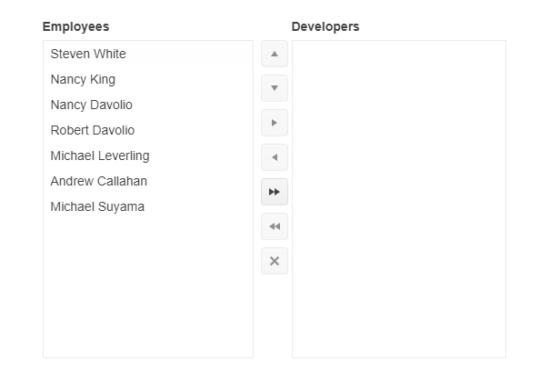

# {{ site.product }} ListBox Overview

The ListBox provides suggestions depending on the typed text and allows multiple value entries.

The component displays a list of data that is contained in a box and allows single or multiple selection, reordering of selected items, and deleting items and features keyboard navigation as well as the dragging and dropping of items. You can also connect the ListBox with another list-box and customize the component with the use of templates, toolbar positioning, placeholder and hint, and localization of its command buttons messages.

## Functionality and Features

* [Data Binding]()&mdash;You can configure both local and remote data for the ListBox.
* [Selection]()&mdash;The component supports single and multiple selection.
* [Dragging and Dropping]()&mdash;The ListBox supports rearranging of its items by using the drag-and-drop feature.
* [Templates]()&mdash;The ListBox allows you to customize its items by using a template.
* [Localization]()&mdash;The ListBox allows you to provide translations to different languages.

## Next Steps 

* [Getting Started with the Kendo UI ListBox for jQuery]()
* [Demo Page for the ListBox](https://demos.telerik.com/kendo-ui/listbox/index)
* [JavaScript API Reference of the ListBox](/api/javascript/ui/listbox)

## See Also

* [Basic Usage of the ListBox (Demo)](https://demos.telerik.com/kendo-ui/listbox/index)
* [Using the API of the ListBox (Demo)](https://demos.telerik.com/kendo-ui/listbox/api)
* [JavaScript API Reference of the ListBox](/api/javascript/ui/listbox)
