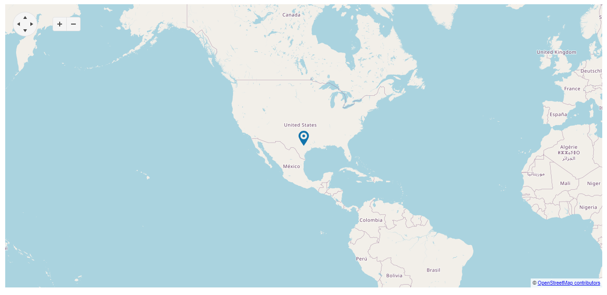

# {{ site.product }} Map Overview

The Map displays geospatial information organized in layers and is supported for both desktop and mobile devices.

It also provides tile layers, shape (vector) layers, and marker layers.

## Functionality and Features

* [Layers]()&mdash;Learn the possible options to render the layers.
* [Creating maps]()&mdash;You can create your own map using datasets.
* [Implementation with Azure](https://docs.telerik.com/kendo-ui/knowledge-base/map-implementation-with-azure)&mdash;You can configure the Map to work with Azure service.

## Next Steps 

* [Getting Started with the Kendo UI Map for jQuery]()
* [Overview of the Map (Demo)](https://demos.telerik.com/kendo-ui/map/index)
* [JavaScript API Reference of the Map](/api/javascript/dataviz/ui/map/configuration)

## See Also

* [Overview of the Map (Demo)](https://demos.telerik.com/kendo-ui/map/index)
* [Using the API of the Map (Demo)](https://demos.telerik.com/kendo-ui/map/api)
* [JavaScript API Reference of the Map](/api/javascript/dataviz/ui/map/configuration)
