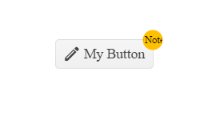

# {{ site.product }} Button Overview

The Button provides consistent styling for a clickable UI functionality rendering arbitrary content and also keyboard operability for elements that do not natively support such (for example, `span`).

You can initialize a single Button or multiple Buttons at once depending on your requirements. 

Following the web standards requirements not to place block elements (for example, `a` or `span`) inside inline elements (for example, `div` or `p`), you can use the Button to host both element types. 

However, note that due to the special and individual behavior of clickable elements, placing hyperlinks or textboxes inside the Button may cause undesired side effects.

## Functionality and Features

* [Disabled Button]()&mdash;The Button allows you to temporary disable or enable it. 
* [Icon Button]()&mdash;You can also add a variety of icons to the Button UI elements of the page to enhance their visual representation. 
* [Globalization]()&mdash;The Button supports globalization to ensure that it can fit well in any application, no matter what [languages and locales]() need to be supported. Additionally, the Button supports [rendering in a right-to-left (RTL) direction]().
* [Accessibility]()&mdash;The Button is accessible for screen readers, supports WAI-ARIA attributes, and delivers [keyboard shortcuts for faster navigation]().

## Next Steps

* [Getting Started with the Kendo UI Button for jQuery]()
* [Basic Usage of the Button (Demo)](https://demos.telerik.com/kendo-ui/button/index)
* [Basic Events in the Button (Demo)](https://demos.telerik.com/kendo-ui/button/events)

## See Also

* [Binding the Button over MVVM (Demo)](https://demos.telerik.com/kendo-ui/button/mvvm)
* [Applying the Button API (Demo)](https://demos.telerik.com/kendo-ui/button/api)
* [JavaScript API Reference of the Button](/api/javascript/ui/button)
