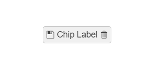

# Chip Overview

The Chip is a compact element that represents an input, attribute, or action. The component enables user input and verifies that input by converting text into chips.

The component can be clicked or removed and supports various styling options. The Chip is commonly used in email templates where each chip is a single person.

## Functionality and Features

* [Customization]()&mdash;You can add a [`Select`] or [`Remove`] custom icon to the Chip as well as display avatars in it.
* [Appearance]()&mdash;The Chip delivers ready-to-use, predefined sets of styling options.

## Next Steps

* [Getting Started with the Kendo UI Chip for jQuery]()
* [Basic Usage of the Chip (Demo)](https://demos.telerik.com/kendo-ui/chip/index)
* [JavaScript API Reference of the Chip](/api/javascript/ui/chip)

## See Also

* [Binding the Chip over MVVM (Demo)](https://demos.telerik.com/kendo-ui/chip/mvvm)
* [Applying the Chip API (Demo)](https://demos.telerik.com/kendo-ui/chip/api)
* [Basic Events in the Chip (Demo)](https://demos.telerik.com/kendo-ui/chip/events)
