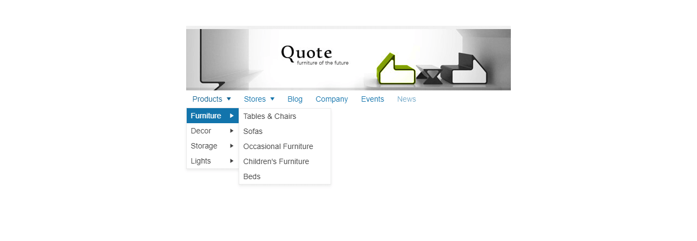

# {{ site.product }} Menu Overview

The Menu displays hierarchical data as a multi-level menu.

The component provides rich styling for unordered lists of items, and can be used for both navigation and execution of JavaScript commands. Items can be defined and initialized from HTML, or through the configuration options.

## Functionality and Features

* [Data binding]()—The Kendo UI for jQuery Menu enables you to bind it to different data sources such as arrays and JSON.
* [Animations]()—The Menu also enables you to provide animations for opening and closing its submenus.
* [Items]()—You can add and customize items such as text, icon, and URLs.
* [Appearance]()—The Menu allows you to customize its appearance by setting CSS classes, templates, and other styling options.
* [Context menu]()—The Menu component supports the creation and implementation of context menus that open on right-click or based on custom events.
* [Accessibility]()—The Menu adheres to the global accessibility standards and provides WAI-ARIA support and keyboard navigation.

## Next Steps

* [Getting Started with the Kendo UI Menu for jQuery]()
* [Menu Overview (Demo)](https://demos.telerik.com/kendo-ui/menu/index)
* [Using the API of the Menu (Demo)](https://demos.telerik.com/kendo-ui/menu/api)

## See Also

* [Initializing the Menu from HTML]()
* [JavaScript API Reference of the Menu](/api/javascript/ui/menu)
* [Demo Page for the jQuery Menu](https://demos.telerik.com/kendo-ui/menu/index)
* [jQuery Menu Product Page](https://www.telerik.com/kendo-jquery-ui/menu)
* [Knowledge Base Section](/knowledge-base)

