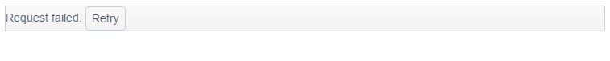

# Data Binding

The PanelBar provides options for binding it to local data arrays and remote data services.

For more information on binding the PanelBar to different service end-points, refer to the article about [`HierarchicalDataSource`](/api/framework/hierarchicaldatasource).

## Binding to Local Data

This approach is available as of the Kendo UI R1 2017 release.

The following example demonstrates how to create a PanelBar and bind it to a local data source.

    

    

## Binding to Remote Data

This approach is available as of the Kendo UI R1 2017 release.

The following example demonstrates how to create a PanelBar and bind it to a remote HierarchicalDataSource.

    

    

## Retry of Data Binding

As of the Kendo UI R1 2017 release, the PanelBar provides a built-in functionality of attempting a retry. If the initial data binding fails and regardless of the reason for the failure, you are now prompted with a `Request failed.` message. To initiate a new data binding, use the **Retry** button.

## See Also

* [Local Data Binding of the PanelBar (Demo)](https://demos.telerik.com/kendo-ui/panelbar/local-data-binding)
* [Remote Data Binding of the PanelBar (Demo)](https://demos.telerik.com/kendo-ui/panelbar/remote-data-binding)
* [JavaScript API Reference of the PanelBar](/api/javascript/ui/panelbar)
