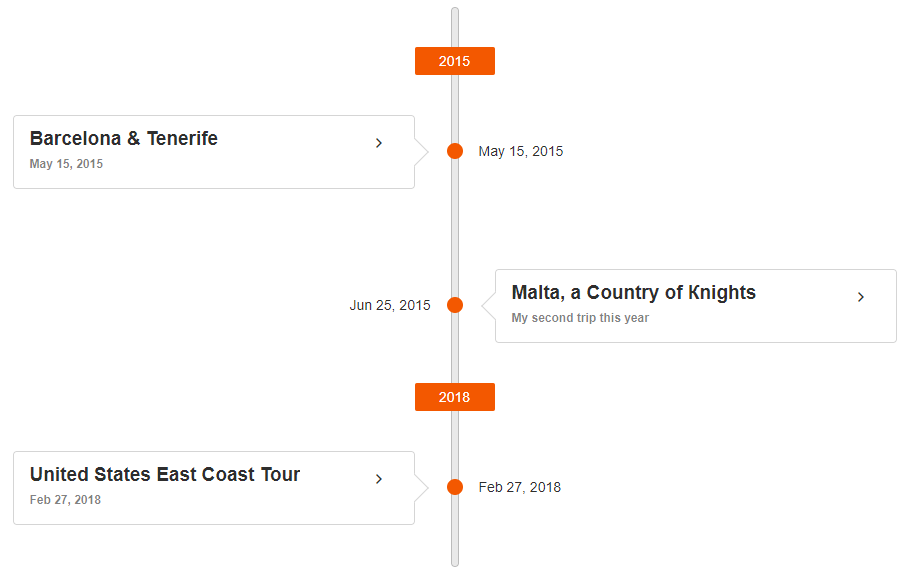

# TimeLine Overview

The Kendo UI TimeLine widget displays a collection of events and their data in a chronological succession for each year.

You can scroll through the events and collapse/expand them. The events order can be vertical or horizontal, and you can customize their templates, as well as respond to events and use API control the widget behavior. You can also control the format of the rendered date for the event. If you provide a list of actions, they will be rendered as links after the description and images.

* [Demo page for the TimeLine](https://demos.telerik.com/kendo-ui/timeline/index)

The following image demonstrates a TimeLine widget.



## Initializing the TimeLine

To initialize the TimeLine, use a blank `<div>` element and the `kendoTimeline()` method. In its arguments, provide a JSON literal with the options for the widget and a data source that contains the information about the events.

> Create the TimeLine within a `$(document).ready()` statement because the widget has to be initialized after the DOM is fully loaded.

The following example demonstrates how to initialize the TimeLine from a JSON `data` object. You can use a remote data source that will return the array of JSON literals instead of a local array of data. The `date` field in such a data source must be parsable by JavaScript (for example, `yyyy-mm-dd` or [ISO 8601](https://en.wikipedia.org/wiki/ISO_8601)). The widget data source is a [Kendo DataSource](/framework/datasource/overview) widget so you can use its features.

```dojo
<div id="timeline"></div>
<script>
    $(document).ready(function () {
        $("#timeline").kendoTimeline({
            orientation: "vertical", // Define the layout of the widget.
            alterMode: true, // Render the events on both sides of the axis in the vertical mode.
            collapsibleEvents: true, // Start all collapsed events in the vertical mode.
            dataSource: {
                data: eventsData, // Defined later in this snippet.
                schema: {
                    model: {
                        fields: {
                            date: {
                                type: "date"
                            },
                        }
                    }
                }
            }
        });
    });

    // The literals in this example use the default field names the widget takes.
    var eventsData = [
        {
            description: "First event description.",
            date: new Date(2015, 4, 15),
            title: "Barcelona \u0026 Tenerife",
            subtitle: "May 15, 2015",
            images: [
                {
                    src: "https://demos.telerik.com/aspnet-mvc/tripxpert/Images/Gallery/Barcelona-and-Tenerife/Arc-de-Triomf,-Barcelona,-Spain_Liliya-Karakoleva.JPG?width=500&amp;height=500"
                }
            ],
            actions: [
                {
                    text: "More info about Barcelona",
                    url: "https://en.wikipedia.org/wiki/Barcelona"
                }
            ]
        },
        {
            description: "The second event description.",
            date: new Date(2018, 1, 27),
            title: "United States East Coast Tour",
            subtitle: "Feb 27, 2018",
            images: [
                {
                    src: "https://demos.telerik.com/aspnet-mvc/tripxpert/Images/Gallery/United-States/Boston-Old-South-Church_Ivo-Igov.JPG?width=500&amp;height=500"
                }
            ],
            actions: [
                {
                    text: "More info about New York City",
                    url: "https://en.wikipedia.org/wiki/New_York_City"
                }
            ]
        },
        {
            description: "Third event description.",
            date: new Date(2015, 5, 25),
            subtitle: "My second trip this year",
            title: "Malta, a Country of Кnights",
            images: [
                {
                    src: "https://demos.telerik.com/aspnet-mvc/tripxpert/Images/Gallery/Malta/Bibliotheca-National-Library_Marie-Lan-Nguyen.JPG?width=500&amp;height=500"
                }
            ],
            actions: [
                {
                    text: "More info about Malta",
                    url: "https://en.wikipedia.org/wiki/Malta"
                }
            ]
        }
    ];
</script>
```

## Functionality and Features

* [Orientation]()
* [Actions]()
* [Images]()
* [Templates]()

## Referencing Existing Instances

To refer to an existing TimeLine instance, use the `jQuery.data()` method. Once a reference is established, use the [TimeLine API](/api/javascript/ui/timeline) to control its behavior.

```
var timeLine = $("#timeline").data("kendoTimeLine");
```

## Events

For a complete example on the basic TimeLine events, refer to the [demo on using the events of the TimeLine](https://demos.telerik.com/kendo-ui/timeline/events) or to its [API reference](/api/javascript/ui/timeline#events).

## See Also

* [Basic Usage of the TimeLine (Demo)](https://demos.telerik.com/kendo-ui/timeline/index)
* [Using the Basic Events of the TimeLine (Demo)](https://demos.telerik.com/kendo-ui/timeline/events)
* [Binding the TimeLine over MVVM (Demo)](https://demos.telerik.com/kendo-ui/timeline/mvvm)
* [Applying the TimeLine API (Demo)](https://demos.telerik.com/kendo-ui/timeline/api)
* [JavaScript API Reference of the TimeLine](/api/javascript/ui/timeline)
