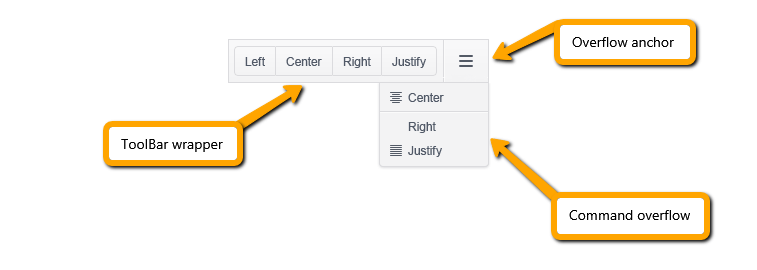

# ToolBar Overview

The ToolBar is designed to hold different types of controls such as buttons, button groups, toggle buttons, split buttons, and other customized elements.

The ToolBar consists of the ToolBar wrapper, overflow anchor, and command overflow popup main areas. The wrapper holds all commands that can be placed within the available container width. The ones that have no space to fit are moved to the command overflow popup.

* [Demo page for the ToolBar](https://demos.telerik.com/kendo-ui/toolbar/index)

The following image demonstrates a Kendo UI ToolBar.

## Initializing the ToolBar

The following example demonstrates how to initialize the ToolBar and apply its basic functionalities.

    

    

## Functionality and Features

* [Command types]()
* [Templates]()
* [Appearance]()

## Events

The ToolBar widget exposes a set of [events](/api/javascript/ui/toolbar#events). For a runnable example, refer to the [demo on using the event of the ToolBar](https://demos.telerik.com/kendo-ui/toolbar/events).

    

    

## See Also

* [Basic Usage of the ToolBar (Demo)](https://demos.telerik.com/kendo-ui/toolbar/index)
* [Using the API of the ToolBar (Demo)](https://demos.telerik.com/kendo-ui/toolbar/api)
* [JavaScript API Reference of the ToolBar](/api/javascript/ui/toolbar)
