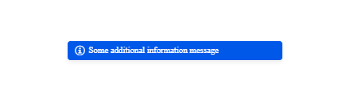

# {{ site.product }} Notification Overview

The Notification provides a styled UI component with arbitrary content which can provide information to the user on various occasions.

You can initialize the Notification from any element because the component does not manipulate the content of that element. The element will be hidden if the component is used with popup notifications or if static notifications are not appended to the Notification element. In these two cases it is assumed that the element will not be needed.

However, if the Notification element is intended to contain static (non-popup) notifications, then its tag is recommended to be such so as to allow the nesting of elements inside the notification template. For example, inline elements, such as ``, `<a>`, or `<em>`, cannot contain block elements, such as `
`, `
`, `<ul>`, `<li>`, or headings. It is perfectly fine to use a `
` element for initiating the component.

## Functionality and Features

* [Notification types]()&mdash;The Notification supports a set of built-in types which indicate the outcome of a process, for example, success or error.
* [Messages]()&mdash;You can use the popup and static layout of the Notification to communicate its message.
* [Hiding]()&mdash;The Notification enables you to configure the duration it will remain open after its initial load.  
* [Templates]()&mdash;You can also apply a template to the corresponding built-in or custom notification type and customize the behavior and styling of the component.
* [Globalization]()&mdash;The Notification provides globalization options  to fit well in any application no matter what languages and locales are required, and also enables you to position it and render its content in a right-to-left (RTL) direction.
* [Accessibility]()&mdash;The Notification is accessible for screen readers and supports WAI-ARIA attributes.

## See Also

* [Getting Started with the Kendo UI Notification for jQuery]()
* [Basic Usage of the Notification (Demo)](https://demos.telerik.com/kendo-ui/notification/index)
* [Using the API of the Notification (Demo)](https://demos.telerik.com/kendo-ui/notification/api)
* [JavaScript API Reference of the Notification](/api/javascript/ui/notification)
