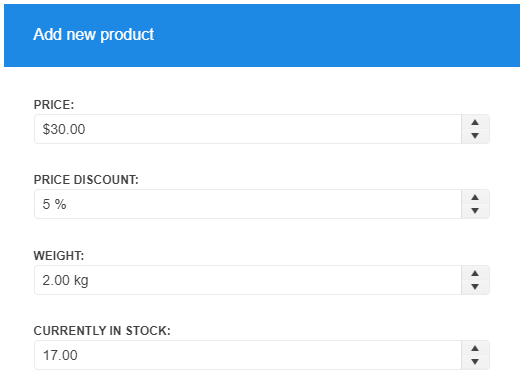

# {{ site.product }} NumericTextBox Overview

The NumericTextBox converts an `<input>` element into a numeric, percentage, or currency textbox.

By default, the widget renders **Spin** buttons which increase or decrease the value with a predefined step.

## Functionality and Features

* [Formats]()&mdash;You can use the specific `format` property of the NumericTextBox and define the conversion data type such as currency or percentage.
* [Input Restrictions]()&mdash;The NumericTextBox enables you to impose restrictions on the input value, for example, to control the precision of the entered number.
* [Globalization]()&mdash;The NumericTextBox supports globalization to ensure that it can fit well in any application, no matter what [languages and locales]() need to be supported. Additionally, the NumericTextBox supports [rendering in a right-to-left (RTL) direction]().
* [Prefix and suffix]()&mdash;The NumericTextBox component lets you add custom content as prefix and suffix adornments.
* [Accessibility]()&mdash;The NumericTextBox is accessible for screen readers, supports WAI-ARIA attributes, and delivers [keyboard shortcuts for faster navigation]().

>tip To learn more about the appearance, anatomy, and accessibility of the NumericTextBox, visit the [Progress Design System documentation](https://www.telerik.com/design-system/docs/components/numerictextbox/)—an information portal offering rich component usage guidelines, descriptions of the available style variables, and globalization support details.

## Next Steps

* [Getting Started with the Kendo UI NumericTextBox for jQuery]()
* [Demo Page for the NumerictTextBox](https://demos.telerik.com/kendo-ui/numerictextbox/index)
* [JavaScript API Reference of the NumericTextBox](/api/javascript/ui/numerictextbox)

## See Also

* [Basic Usage of the NumericTextBox (Demo)](https://demos.telerik.com/kendo-ui/numerictextbox/index)
* [Using the Basic Events of the NumericTextBox (Demo)](https://demos.telerik.com/kendo-ui/numerictextbox/events)
* [Binding the NumericTextBox over MVVM (Demo)](https://demos.telerik.com/kendo-ui/numerictextbox/mvvm)
* [Applying the NumericTextBox API (Demo)](https://demos.telerik.com/kendo-ui/numerictextbox/api)
* [JavaScript API Reference of the NumericTextBox](/api/javascript/ui/numerictextbox)
* [Known Limitations in the NumericTextBox]()
