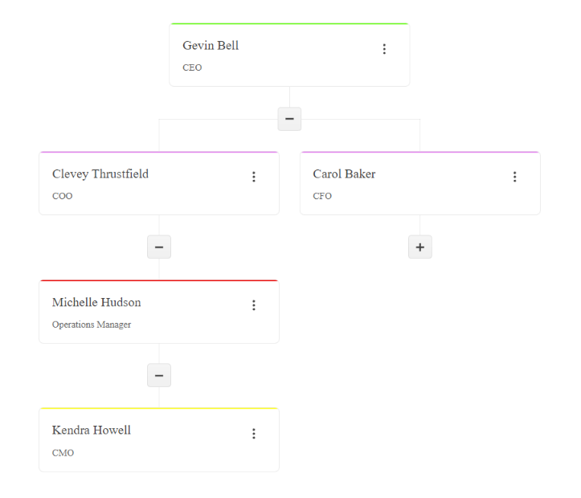

# {{ site.product }} OrgChart Overview

The Kendo UI OrgChart allows you to view and interact with an organizational structures. It gives the possibility to easily visualize hierarchies and is very useful in scenarios like what teams employees are part of and who they report to. 

It provides a tree-like structure where the user can edit the individual items, change the items parent, or group the nodes in the tree.

## Functionality and Features

* [Data Binding]()-You can bind the OrgChart to local or remote data.
* [Editing]()-The OrgChart allows you to disable its editing functionality.
* [Grouping]()-You can display the nodes in the OrgChart grouped by a specified field.
* [Templates]()-You can customize the appearance of the OrgChart cards.
* [Accessibility]()-The OrgChart is accessible for screen readers, supports WAI-ARIA attributes, and delivers [keyboard shortcuts for faster navigation]().

## See Also

* [Getting Started with the OrgChart]()
* [Basic Usage of the OrgChart (Demo)](https://demos.telerik.com/kendo-ui/orgchart/index)
* [Kendo UI OrgChart Data binding]()
* [Kendo UI OrgChart Grouping]()
* [JavaScript API Reference of the OrgChart](/api/javascript/ui/orgchart)
