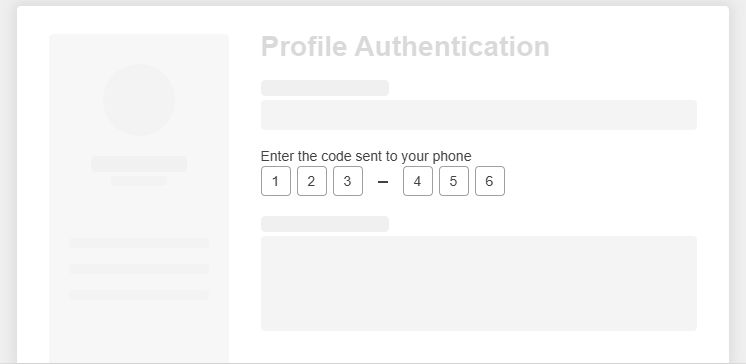

# {{ site.product }} OTPInput Overview

The OTPInput is a UI component that allows the user to enter a one-time password (OTP) during multi-factor authentication. Its sole purpose is to strengthen applications in terms of security while offering a seamless user experience during user interaction.

## Functionality and Features

* [Appearance]()&mdash;You can use the available styling options for configuring the size, border radius, and fill mode of the OTPInput.
* [Separators]()&mdash;The OTPInput supports different types of separators between the item groups.
* [Adaptiveness]()&mdash;The OTPInput allows you to configure what type of virtual keyboard will be displayed when working with the component on a mobile device.
* [Accessibility]()&mdash;The OTPInput is accessible for screen readers, supports WAI-ARIA attributes, and delivers [keyboard shortcuts for faster navigation]().

## Next Steps

* [Getting Started with the Kendo UI OTPInput for jQuery]()
* [Demo Page for the OTPInput](https://demos.telerik.com/kendo-ui/otpinput/index)
* [JavaScript API Reference of the OTPInput](/api/javascript/ui/otpinput)

## See Also

* [Overview of the OTPInput (Demo)](https://demos.telerik.com/kendo-ui/otpinput/index) 
* [Applying the OTPInput API (Demo)](https://demos.telerik.com/kendo-ui/otpinput/api)
* [JavaScript API Reference of the OTPInput](/api/javascript/ui/otpinput) 

