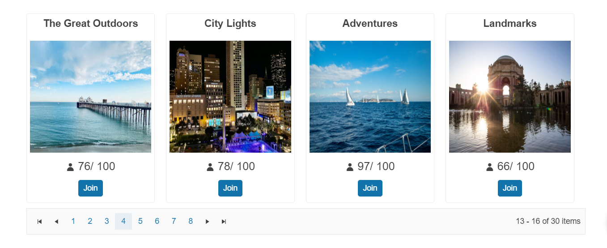

# {{ site.product }} Pager Overview

The [Kendo UI Pager component](https://demos.telerik.com/kendo-ui/pager/index) enables splitting a set of data into pages with flexible and intuitive UI.

The user interface of the Pager is useful for paging data-bound components that have a [data source](/api/javascript/data/datasource) and do not have a built-in UI for paging such as the ListView or scenarios that require  paging options&mdash;for example, Kendo Templates with a data source.

 You can customize the page number templates or use an input for navigation to a specific page, toggle the visibility of previous and next buttons, include a pagesize dropdown and alter the information messages. The pager API also offers the ability to [localize its messages]().

## Functionality and Features

* [Pager Settings and Types]()&mdash;The user can change the current page by using the Pager's buttons or by entering the desired page number into the available input.
* [Responsive Pager]()&mdash;Learn more about the responsiveness of the Pager and how to enable/disable it.
* [Pager Templates]()&mdash;The Pager allows you to use templates to configure its page links.
* [Globalization and Messages]()&mdash;The Pager supports globalization to ensure that it can fit well in any application, no matter what [languages and locales]() need to be supported. Additionally, the Pager supports rendering in a right-to-left (RTL) direction.
* [Accessibility]()&mdash;The Pager is accessible for screen readers, supports WAI-ARIA attributes, and delivers [keyboard shortcuts for faster navigation]().

## Next Steps 

* [Getting Started with the Kendo UI Pager for jQuery]()
* [Demo Page for the Pager](https://demos.telerik.com/kendo-ui/grid/index)
* [JavaScript API Reference of the Pager](/api/javascript/ui/pager)

## See Also

* [Demo Page for the Pager](https://demos.telerik.com/kendo-ui/pager/index)
* [Pager Integration (Demo)](https://demos.telerik.com/kendo-ui/pager/integration)
* [JavaScript API Reference of the Pager](/api/javascript/ui/pager)
