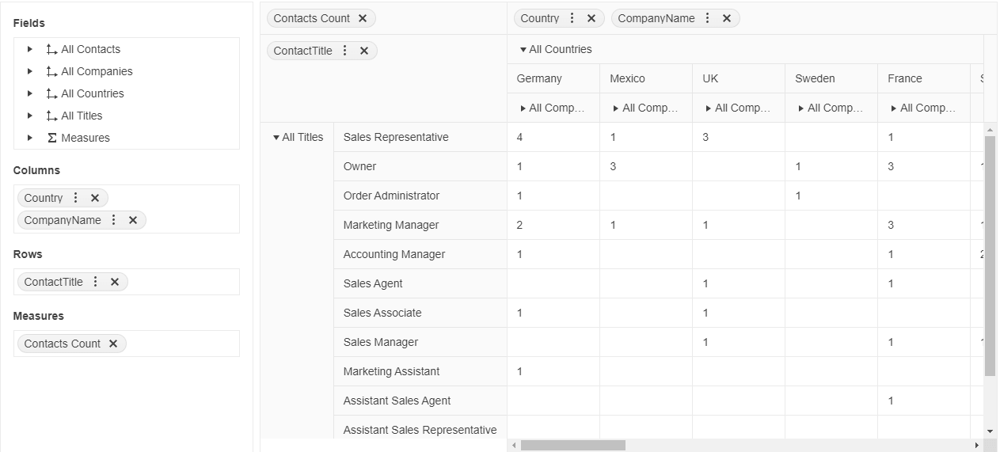

# {{ site.product }} PivotGrid Overview

The Kendo UI PivotGrid represents multidimensional data in a cross-tabular format.

> The new PivotGridV2 is now available. It offers a brand new design and a new future-proof architecture that allows the implementation of many upcoming functionalities. As PivotGridV2 aims to replace the legacy PivotGrid, it is recommended to use the PivotGridV2 in your new projects. For information about the differences between the PivotGrid and PivotGridV2, refer to the [Comparison]() article.

## Functionality and Features

* [Data Binding]()&mdash;The Kendo UI PivotGrid supports data binding to an HTTP accessible Online Analytical Processing (OLAP) cube and to flat data.
* [Filtering]()&mdash;The PivotGrid supports filtering both in the OLAP and flat data-binding scenarios.
* [Sorting]()&mdash;The PivotGrid supports sorting both in the OLAP and flat data-binding scenarios.
* [Excel Export]()&mdash;The PivotGrid enables you to export its content to Excel.
* [PDF Export]()&mdash;The PivotGrid provides a built-in PDF export functionality.

## Next Steps 

* [Getting Started with the Kendo UI PivotGrid for jQuery]()
* [Demo Page for the PivotGrid](https://demos.telerik.com/kendo-ui/pivotgrid/index)
* [PivotGrid JavaScript API Reference](/api/javascript/ui/pivotgrid)

## See Also

* [Demo Page for the jQuery PivotGrid](https://demos.telerik.com/kendo-ui/pivotgrid/index)
* [PivotGrid JavaScript API Reference](/api/javascript/ui/pivotgrid)
* [Knowledge Base Section](/knowledge-base)