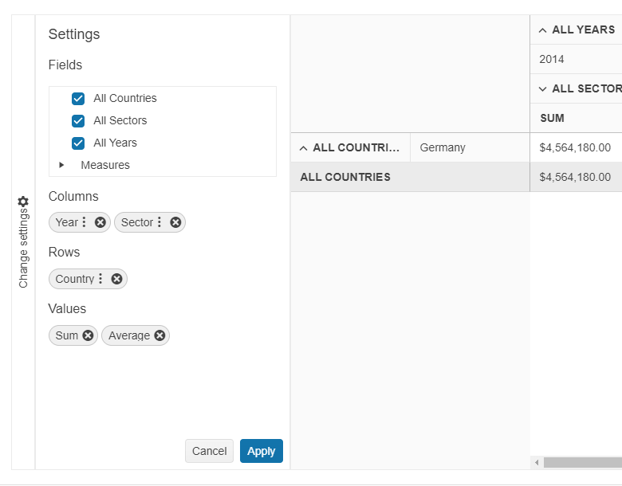

# Filtering

The PivotGridV2 supports filtering both in the OLAP and flat data-binding scenarios.

The PivotGridV2 uses [`kendo.data.PivotDataSourceV2`](/api/javascript/data/pivotdatasourcev2) to perform `label` filtration. However, it filters only by the caption value of the members.

The following image from the [Local Binding](https://demos.telerik.com/kendo-ui/pivotgridv2/local-flat-data-binding) demo demonstrates how end-users can apply a filter.


The next image demonstrates the result when the end-user applies a filter to the **Country** row.



## Enabling Filtering

To enable the filtering functionality, set the [`filterable`](/api/javascript/ui/pivotconfiguratorv2/configuration/filterable) configuration of the PivotConfiguratorV2 to `true`.

```javascript
$("#configurator").kendoPivotConfiguratorV2({
    filterable: true,
    // ... other configurations
});
```

## Filter Object Structure

The filter descriptor is similar to [the filter option of the `kendo.data.DataSource`](/api/javascript/data/datasource/configuration/filter) and contains the following options:
- `field`&mdash;The full path to the tuple member. For example, `[Date].[Calendar].[Calendar Year].&[2005]`.
- `operator`&mdash;All operators that work with strings. Note that the component treats field values as strings.
- `value`&mdash;The filter value.

### Filtering when using Xmla DataSource

To set a predefined filter when using Xmla data use the above-described approach and set the filter configuration of the dataSource, following the [guidelines for MDX queries](https://learn.microsoft.com/en-us/analysis-services/multidimensional-models/mdx/mdx-query-fundamentals-analysis-services?view=asallproducts-allversions) and [Members, Tuples, and Sets](https://learn.microsoft.com/en-us/analysis-services/multidimensional-models/mdx/working-with-members-tuples-and-sets-mdx?view=asallproducts-allversions).

The example below demonstrates how to filter data only for cities starting with "M" for the years 2010 and 2013:

```dojo
    <div id="container">
        <div id="pivotgrid"></div>
        <div id="configurator"></div>
        <div id="pivotbutton"></div>
    </div>
    <script>
        $(document).ready(function () {
          var pivotgrid = $("#pivotgrid").kendoPivotGridV2({
            height: 700,
            dataSource: {
              type: "xmla",
              columns: [{ name: ['[Date].[Calendar]'], expand: true },
                        { name: ['[Product].[Category]'] }],
              rows: [{ name: ['[Geography].[City]'], expand: true }],
              measures: [{ name: ['[Measures].[Reseller Freight Cost]'] }],
              transport: {
                connection: {
                  catalog: "Adventure Works DW 2008R2",
                  cube: "Adventure Works"
                },
                read: 'https://demos.telerik.com/service/v2/olap/msmdpump.dll'
              },
              filter:[
                  {
                    field: "[Geography].[City]",
                    operator: "startswith",
                    value: "M"
                  },
                  {
                    field: "[Date].[Calendar]",
                    operator: "in",
                    value: "[Date].[Calendar].[Calendar Year].&[2010],[Date].[Calendar].[Calendar Year].&[2013]"
                  }
                ]
            }
          }).data("kendoPivotGridV2");

          $("#configurator").kendoPivotConfiguratorV2({
            dataSource: pivotgrid.dataSource,
            filterable: true,
            sortable: true
          });

          $("#pivotbutton").kendoPivotConfiguratorButton({
            configurator: "configurator"
          });

          $("#container").kendoPivotContainer({
            configuratorPosition: "left"
          });
        });
    </script>
```

### Filtering when using Flat Data

Build the filter descriptor similar to [the filter option of the `kendo.data.DataSource`](/api/javascript/data/datasource/configuration/filter).

For example, to filter a [PivotGridV2 bound to local data](https://demos.telerik.com/kendo-ui/pivotgridv2/local-flat-data-binding) for countries starting with "S" for the year 2022 you can provide a filter configuration as demonstrated below:

```
    dataSource: {
        data: revenue,
        sort: { field: "Year", dir: "asc" },
        schema: {
            model: {
            fields: {
                Country: { type: "string" },
                Revenue: { type: "number" },
                Year: { type: "number" },
                Sector: { type: "string" }
            }
            },
            cube: {
            dimensions: {
                Country: { caption: "All Countries" },
                Sector: { caption: "All Sectors" },
                Year: { caption: "All Years" }
            },
            measures: {
                "Sum": { field: "Revenue", format: "{0:c}", aggregate: "sum" },
                "Average": { field: "Revenue", format: "{0:c}", aggregate: "average" }
            }
            }
        },
        columns: [{ name: "Year", expand: true }, { name: "Sector" } ],
        rows: [{ name: "Country", expand: true }],
        measures: ["Sum", "Average"],
        filter:[{ field: "Country", operator: "startswith", value: "S" },
            { field: "Year", operator: "eq", value: 2022 }]
    }
```

## See Also

* [Basic Usage of the PivotGridV2 (Demo)](https://demos.telerik.com/kendo-ui/pivotgridv2/index)
* [Binding the PivotGridV2 for flat local data (Demo)](https://demos.telerik.com/kendo-ui/pivotgridv2/local-flat-data-binding)
* [PivotGridV2 JavaScript API Reference](/api/javascript/ui/pivotgridv2)
