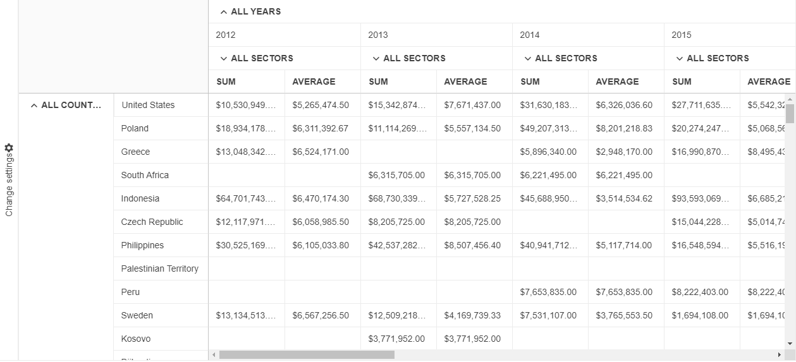

# {{ site.product }} PivotGridV2 Overview

The Kendo UI PivotGridV2 represents multidimensional data in a cross-tabular format.

Compared to the legacy PivotGrid, the new PivotGridV2 offers a brand new design, and its future-proof architecture allows the implementation of many upcoming functionalities. As PivotGridV2 aims to replace the legacy PivotGrid, it is recommended to use the PivotGridV2 in your new projects. For information about the differences between the PivotGrid and PivotGridV2, refer to the [Comparison]() article.

## Functionality and Features

* [Data Binding]()&mdash;The Kendo UI PivotGridV2 supports data binding to an HTTP-accessible Online Analytical Processing (OLAP) cube and to local arrays of data.
* [Templates]()&mdash;The Kendo UI PivotGridV2 provides the built-in functionality to change the appearance of the rendered data.
* [PDF Export]()&mdash;The PivotGridV2 provides a built-in PDF export functionality.
* [Filtering]()&mdash;The PivotGridV2 supports filtering both in the OLAP and flat data-binding scenarios.

## Next Steps 

* [Getting Started with the Kendo UI PivotGridV2 for jQuery]()
* [Demo Page for the PivotGridV2](https://demos.telerik.com/kendo-ui/pivotgridv2/index)
* [PivotGrid JavaScript API Reference](/api/javascript/ui/pivotgridv2)

## See Also

* [Demo Page for the jQuery PivotGridV2](https://demos.telerik.com/kendo-ui/pivotgridv2/index)
* [PivotGridV2 JavaScript API Reference](/api/javascript/ui/pivotgridv2)
* [Knowledge Base Section](/knowledge-base)
