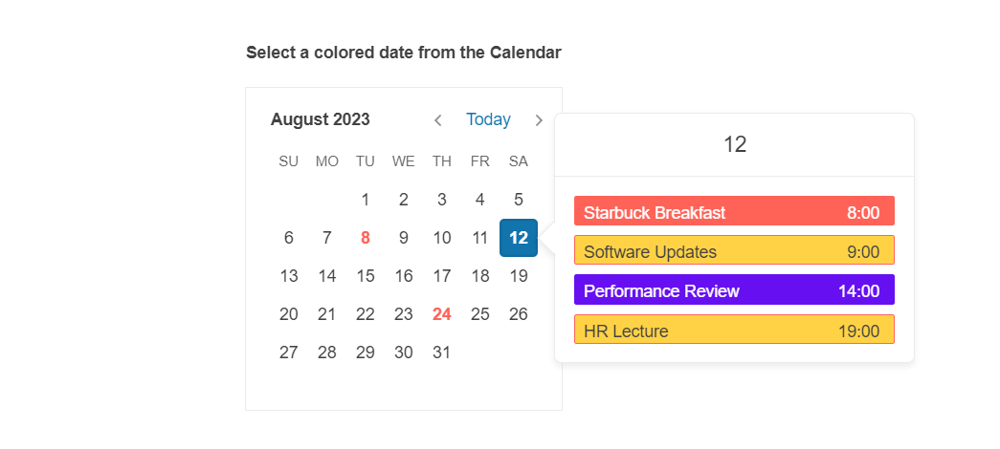

# {{ site.product }} Popover Overview

The Kendo UI Popover widget for jQuery provides a simple way to display additional content next to a specific anchor element that appears when users perform actions on that anchor element such as click or hover.

## Functionality and Features

* [Templates]()&mdash;The Popover allows you to customize its content by using a template.
* [Events]()&mdash;The Popover component supports convenient events that allow you to extend its default functionality.
* [Accessibility]()&mdash;The Popover is accessible for screen readers and supports WAI-ARIA attributes.

## Next Steps 

* [Getting Started with the Kendo UI Popover for jQuery]()
* [Demo Page for the Popover](https://demos.telerik.com/kendo-ui/popover/index)
* [JavaScript API Reference of the Popover](/api/javascript/ui/popover)

## See Also

* [Using the API of the Popover (Demo)](https://demos.telerik.com/kendo-ui/popover/api)
* [JavaScript API Reference of the Popover](/api/javascript/ui/popover)