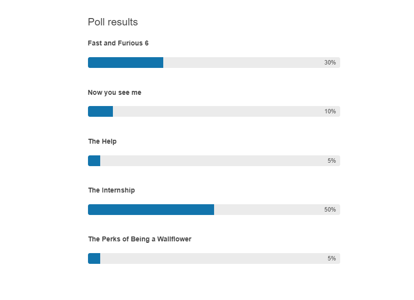

# {{ site.product }} ProgressBar Overview

The ProgressBar delivers rich functionality for displaying and tracking the progress of a task.

## Functionality and Features

* [Appearance]()&mdash;The ProgressBar exposes various options that allow you to change its layout.
* [Accessibility]()&mdash;The ProgressBar is accessible for screen readers, and supports WAI-ARIA attributes.

## Next Steps

* [Getting Started with the Kendo UI ProgressBar for jQuery]()
* [Overview of the ProgressBar (Demo)](https://demos.telerik.com/kendo-ui/progressbar/index) 

## See Also
 
* [Events of the ProgressBar (Demo)](https://demos.telerik.com/kendo-ui/progressbar/events)
* [Applying the ProgressBar API (Demo)](https://demos.telerik.com/kendo-ui/progressbar/api)
* [JavaScript API Reference of the ProgressBar](/api/javascript/ui/progressbar)