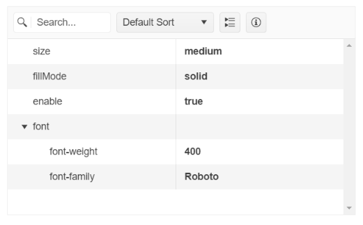

# {{ site.framework }} PropertyGrid Overview

The Kendo UI for jQuery PropertyGrid is a user interface component that provides a convenient way for users to view and edit the properties and attributes of objects or items. It shows the properties in a structured and organized way, enabling effortless modification. The component displays one column that contains the fields of the bound model and a second column that allows editing of the values.  

## Functionality and Features

* [Accessibility]()&mdash;The PropertyGrid is accessible for screen readers, supports WAI-ARIA attributes, and delivers [keyboard shortcuts for faster navigation]().

## Next Steps

* [Getting Started with the Kendo UI PropertyGrid for jQuery]()
* [Basic Usage of the PropertyGrid (Demo)](https://demos.telerik.com/kendo-ui/propertygrid/index)

## See Also

* [Overview of the PropertyGrid (Demo)](https://demos.telerik.com/kendo-ui/propertygrid/index)
* [JavaScript API Reference of the PropertyGrid](/api/javascript/ui/propertygrid)

