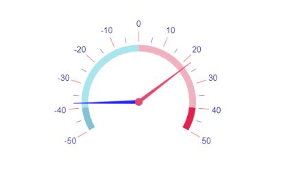

# {{ site.product }} RadialGauge Overview

The [Kendo UI RadialGauge widget](https://demos.telerik.com/kendo-ui/radial-gauge/index) enables users to quickly understand in what certain range a value lies.

All graphics render on the client by using the [Scalable Vector Graphics (SVG)](https://en.wikipedia.org/wiki/Scalable_Vector_Graphics) format.

## Functionality and Features

* [Scale options]()—The RadialGauge provides an option to customize the scale appearance, by setting labels, ticks, background color, etc.
* [Multiple pointers]()—You can render multiple pointers and highlight multiple values. 

## Next Steps

* [Getting Started with the Kendo UI RadialGauge for jQuery]()
* [Basic Usage of the RadialGauge (Demo)](https://demos.telerik.com/kendo-ui/radial-gauge/index)
* [JavaScript API Reference of the RadialGauge](/api/javascript/dataviz/ui/radialgauge)

## See Also

* [Overview of the RadialGauge (Demo)](https://demos.telerik.com/kendo-ui/radial-gauge/index)
* [JavaScript API Reference of the RadialGauge](/api/javascript/dataviz/ui/radialgauge)
