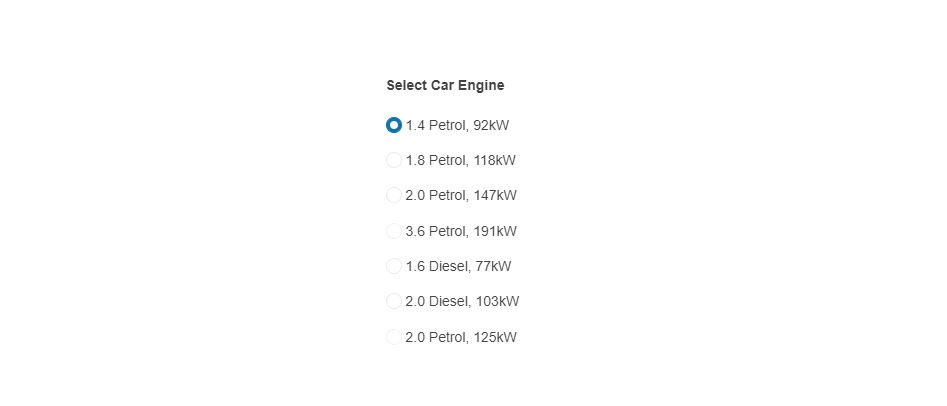

# {{ site.product }} RadioButton Overview

The RadioButton allows you to provide radiobutton functionality to `<input />` elements, style them, disable the RadioButton, and set an encoded or decoded label.

## Functionality and Features

* [Appearance]()&mdash;The RadioButton provides styling options that allow you to change its appearance.
* [Label]()&mdash;You can set a label next to the RadioButton.

>tip To learn more about the appearance, anatomy, and accessibility of the RadioButton, visit the [Progress Design System documentation](https://www.telerik.com/design-system/docs/components/radiobutton/)—an information portal offering rich component usage guidelines, descriptions of the available style variables, and globalization support details.

## Next Steps

* [Getting Started with the Kendo UI RadioButton for jQuery]()
* [Overview of the RadioButton (Demo)](https://demos.telerik.com/kendo-ui/radiobutton/index)
* [Using the API of the RadioButton (Demo)](https://demos.telerik.com/kendo-ui/radiobutton/api)

## See Also

* [Basic Usage of the RadioButton (Demo)](https://demos.telerik.com/kendo-ui/radiobutton/index)
* [JavaScript API Reference of the RadioButton](/api/javascript/ui/radiobutton)
