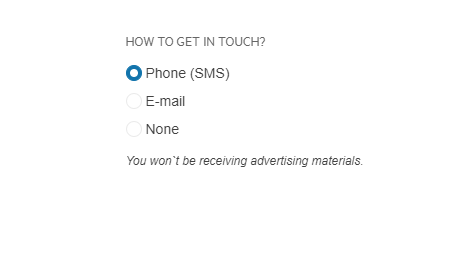

# {{ site.product }} RadioGroup Overview

The RadioGroup allows to style and provide radio buttons functionality to list elements, set the position of the labels, attributes and custom css classes.

## Functionality and Features

* [Binding]()&mdash;You can bind the RadioGroup to an array of items.
* [Label]()&mdash;Learn how the labels are generated depending on how the items are configured.
* [Layout]()&mdash;The RadioGroup supports horizontal and vertical rendering of the items.

## Next Steps

* [Getting Started with the Kendo UI RadioGroup for jQuery]()
* [Overview of the RadioGroup (Demo)](https://demos.telerik.com/kendo-ui/radiogroup/index)
* [Using the API of the RadioGroup (Demo)](https://demos.telerik.com/kendo-ui/radiogroup/api)

## See Also

* [Basic Usage of the RadioGroup (Demo)](https://demos.telerik.com/kendo-ui/radiogroup/index)
* [JavaScript API Reference of the RadioGroup](/api/javascript/ui/radiogroup)
