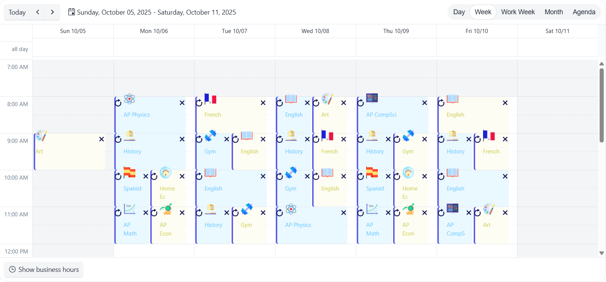

# {{ site.product }} Scheduler Overview

The Scheduler displays a set of events, appointments, or tasks.

It supports the display of scheduled events in different views&mdash;single days, whole weeks, work weeks, months, or as a list of tasks, and provides configuration options for editing, resources, recurrence, and timezone handling.

## Functionality and Features

* [Data Binding]()&mdash;You can configure both local and remote data for the Scheduler events.
* [Views]()&mdash;You can configure the available views in the component. You can also implement a custom view.
* [Resources]()&mdash;The Scheduler supports resources which can be assigned to an event.
* [Timezones]()&mdash;You can display the events according to a specific timezone.
* [Templates]()&mdash;You can customize the rendering of events and other Scheduler content with templates.
* [Printing]()&mdash;You can print the visible content of the Scheduler.
* [Adaptive Rendering]()&mdash;The Scheduler is adaptive to the dimensions of the device you are using.
* [Accessibility]()&mdash;The Scheduler is accessible for screen readers and supports keyboard navigation.

## Next Steps

* [Getting Started with the Kendo UI Scheduler for jQuery]()
* [Demo Page for the Scheduler](https://demos.telerik.com/kendo-ui/scheduler/index)
* [JavaScript API Reference of the Scheduler](/api/ui/scheduler)

## See Also

* [Overview of the Scheduler (Demo)](https://demos.telerik.com/kendo-ui/scheduler/index)
* [Using the API of the Scheduler (Demo)](https://demos.telerik.com/kendo-ui/scheduler/api)
* [JavaScript API Reference of the Scheduler](/api/ui/scheduler)
