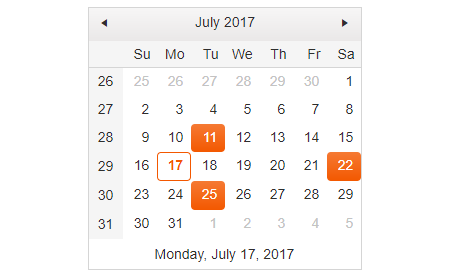
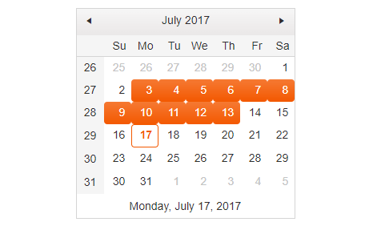
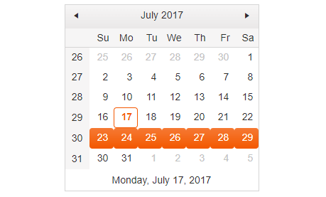

# Selection

The Calendar enables the user to make single, multiple, range-date, and week selections.

For a runnable example, refer to [the demo on multiple selection in the Calendar](https://demos.telerik.com/kendo-ui/calendar/selection).

## Single Date Selection

By default, the Calendar enables the user to select a single date by using the mouse or the keyboard.

## Multiple Date Selection

As of the 2017 R3 release, the Calendar allows you to implement the multiple date selection by using the [`selectable`](/api/javascript/ui/calendar/configuration/selectable) configuration property.

To perform the multiple date selection, the user can also use the keyboard:

* `Ctrl` + mouse-clicking a specific date&mdash;Marks the date as selected. Other previously selected dates remain selected.
* The selection of a date from a specific view without utilizing the `Ctrl` key selects the date of the clicked cell and deselects all previously selected dates including the previously selected dates from other views or months.
* The selection of a date that is already selected while holding the `Ctrl` key removes the date from the selection.

```dojo
   <div id="calendar"></div>
   <script>
    $("#calendar").kendoCalendar({
		selectable: "multiple"
	});
  </script>
```

The following image demonstrates a Calendar with selected multiple dates.



## Range Date Selection

The Calendar enables the range date selection over the keyboard.

The usage of the `Shift` key allows the user to select a range of dates in the same month or across different months:

* `Shift` + mouse-clicking specific dates&mdash;Selects all dates between the most recently selected one (with `Space` or mouse click) and the clicked cell.
* `Shift` + mouse clicking specific dates&mdash;If no previous selection was made, selects all dates from the beginning to the clicked cell.

The following image demonstrates a Calendar with enabled date-range selection.  



## Week Selection

When the user clicks a specific week number, the Calendar selects the entire week. The week selection functionality is a special case of range selection which starts from the first day of the week and selects all dates to the end of the week.

The following image demonstrates a Calendar with enabled week selection.



## See Also

* [Multiple Selection by the Calendar (Demo)](https://demos.telerik.com/kendo-ui/calendar/selection)
* [JavaScript API Reference of the Calendar](/api/javascript/ui/calendar)
