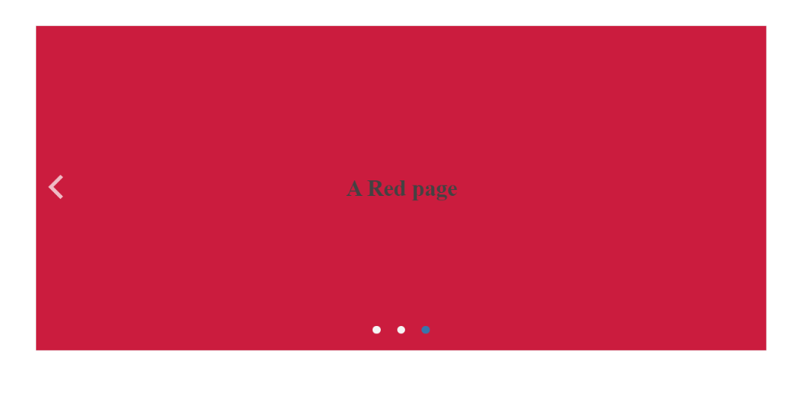

# {{ site.product }} ScrollView Overview

The ScrollView displays a horizontal collection of content or image views with built-in navigation between them.

It can be scrolled through dragging, gestures, arrow click or page click or tap. Among the key features of the ScrollView are data-source binding, customizable template, built-in pager, adjustable bounce effects and scroll velocity.

## Next Steps

* [Getting Started with the Kendo UI ScrollView for jQuery]()

## See Also

* [Basic Usage of the ScrollView (Demo)](https://demos.telerik.com/kendo-ui/scrollview/index)
* [Using the API of the ScrollView (Demo)](https://demos.telerik.com/kendo-ui/scrollview/api)
* [JavaScript API Reference of the ScrollView](/api/javascript/ui/scrollview)
