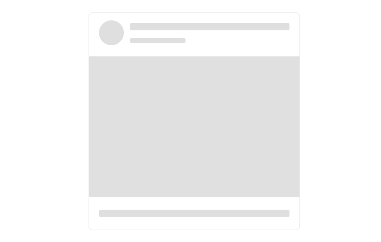

# {{ site.product }} SkeletonContainer Overview

The SkeletonContainer component indicates to the user that the content is coming but has not yet been loaded. It aims at helping the user focus on progress and makes the page load time appear shorter.

A SkeletonContainer is a simplified preview version of a page into which information is gradually loaded (for example by using AJAX requests).

## Functionality and Features

* [Items]()&mdash;The SkeletonContainer exposes an [`items`](/api/javascript/ui/skeletoncontainer/configuration/grid.items) object that represents the settings of the component items.
* [Grid Integration](https://demos.telerik.com/kendo-ui/skeletoncontainer/grid-integration)&mdash;The SkeletonContainer allows a seamless integration of the Kendo UI for jQuery Grid.

## Next Steps 

* [Getting Started with the Kendo UI SkeletonContainer for jQuery]()
* [Overview of the SkeletonContainer (Demo)](https://demos.telerik.com/kendo-ui/skeletoncontainer/index)
* [JavaScript API Reference of the SkeletonContainer](/api/javascript/ui/skeletoncontainer)

## See Also

* [Product Page of the Kendo UI for jQuery SkeletonContainer](https://www.telerik.com/kendo-jquery-ui/skeletoncontainer)
* [Demo Pages for the jQuery SkeletonContainer](https://demos.telerik.com/kendo-ui/skeletoncontainer/index)
* [Knowledge Base Section](/knowledge-base)
