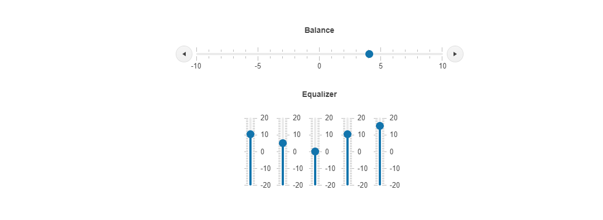

# {{ site.product }} Slider Overview

The Slider provides a rich input for selecting numeric values.

The Slider can either present one handle and two opposing buttons for selecting a single numeric value, or two handlers for defining a range of numeric values. Unlike the HTML5 range input, the Slider enables the consistent experience across browsers and delivers rich API calls and event models. The Slider provides configuration options for customizing its behavior, for example, setting its minimum and maximum values, orientation, step, and tooltip format and placement.

## Functionality and Features

* [Appearance]()&mdash;The Slider provides styling options that allow you to change its appearance.
* [Accessibility]()&mdash;The Slider is accessible for screen readers, supports WAI-ARIA attributes, and delivers [keyboard shortcuts for faster navigation]().

## Next Steps

* [Getting Started with the Kendo UI Slider for jQuery]()
* [Overview of the Slider (Demo)](https://demos.telerik.com/kendo-ui/slider/index)
* [Using the API of the Slider (Demo)](https://demos.telerik.com/kendo-ui/slider/api)

## See Also

* [Basic Usage of the Slider (Demo)](https://demos.telerik.com/kendo-ui/slider/index)
* [Using the API of the Slider (Demo)](https://demos.telerik.com/kendo-ui/slider/api)
* [JavaScript API Reference of the Slider](/api/javascript/ui/slider)
