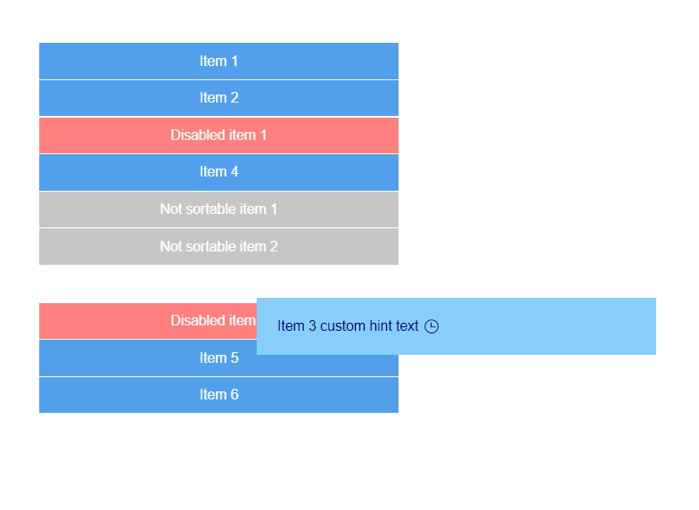

# {{ site.product }} Sortable Overview

The Sortable provides a sortable drag-and-drop functionality to elements within a list.

The Sortable does not support integration with the Kendo UI TreeList component.

## Functionality and Features

* [Hint]()&mdash;Allows you to customize the hint displayed while dragging.
* [Items]()&mdash;You can configure the valid sortable and draggable items.
* [Cursor]()&mdash;Provides the option to configure the type of the cursor.
* [Placeholder]()&mdash;Indicates where the dragged item will be placed when dropped.
* [Integration with other Kendo UI components]()&mdash;You can integrate the Sortable with other Kendo UI for jQuery components.

## Next Steps 

* [Getting Started with the Kendo UI Sortable for jQuery]()
* [Basic Usage of the Sortable (Demo)](https://demos.telerik.com/kendo-ui/sortable/index)
* [JavaScript API Reference of the Sortable](/api/javascript/ui/sortable)

## See Also

* [JavaScript API Reference of the Sortable](/api/javascript/ui/sortable)
* [Common Scenarios with the Sortable Component]()
* [Demo Page for the jQuery Sortable](https://demos.telerik.com/kendo-ui/sortable/index)
* [Knowledge Base Section](/knowledge-base)
* [jQuery Sortable Product Page](https://www.telerik.com/kendo-jquery-ui/sortable)
